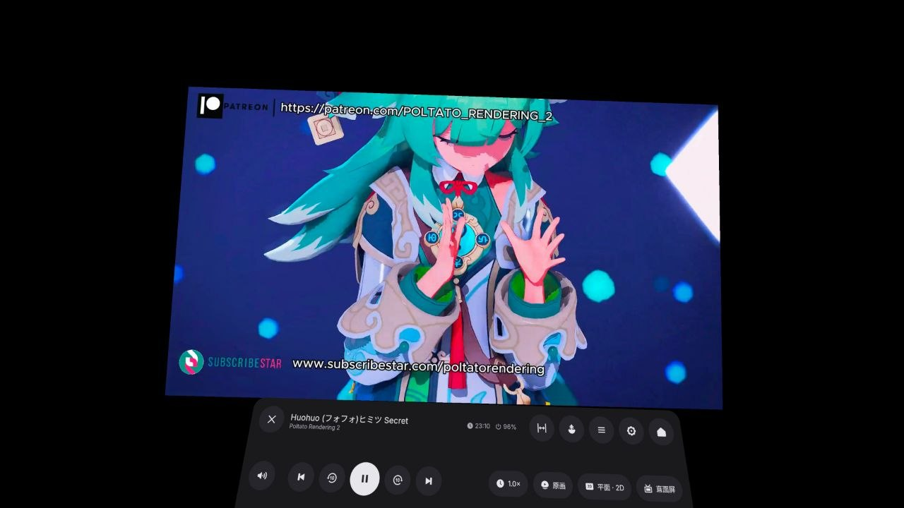
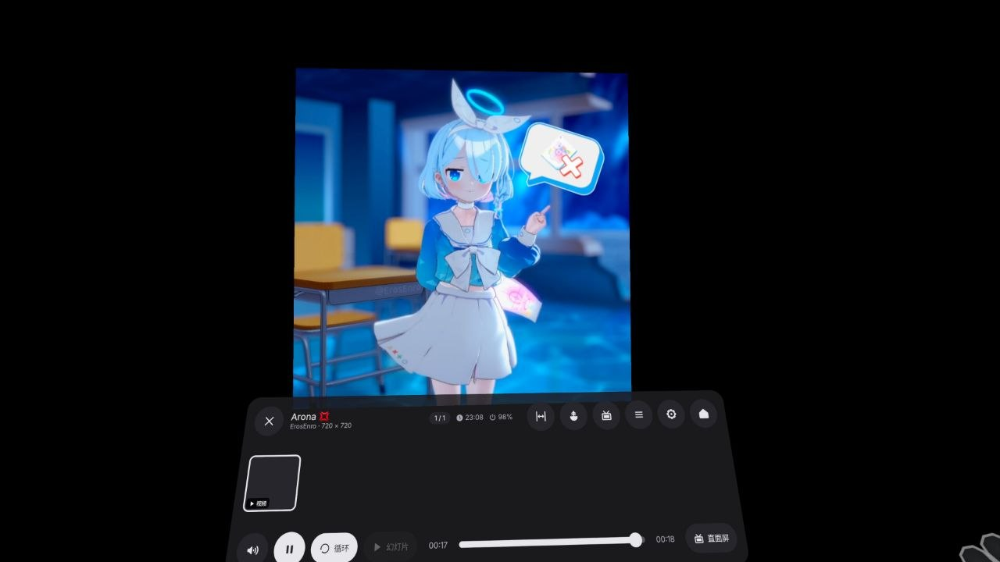

<div align="center">

<a href="https://github.com/FoxSensei001/LoveIwara">
    
</a>

# Love Iwara <sup>(2i)</sup>

**A fast, beautiful, cross-platform third-party Iwara client built with Flutter.**

One codebase → Android · Meta Quest · Windows · macOS · Linux · iOS

[](https://t.me/+ITH4CV6Z_sc2ZWVl)
[](https://github.com/FoxSensei001/LoveIwara)
[](https://github.com/FoxSensei001/LoveIwara)
[](https://github.com/FoxSensei001/LoveIwara/releases/latest)
[](https://github.com/FoxSensei001/LoveIwara/releases)
[](LICENSE)
[](https://github.com/FoxSensei001/LoveIwara/issues)


**English** · [简体中文](README_ZH.md) · [繁體中文](README_ZH_TW.md) · [日本語](README_JA.md)

</div>

---

## 🌟 Introduction

**Love Iwara** (also known as `i_iwara` or **2i**) is a third-party client for [Iwara](https://www.iwara.tv) built with Flutter. It aims to deliver a smooth, native-feeling experience across phones, tablets, and desktops — all from a single codebase covering **Android, Meta Quest, Windows, macOS, Linux, and iOS**.

> [!NOTE]
> This started as a learning project — my first attempt at a cross-platform Flutter app. Some code may not be perfectly polished, but it's actively maintained and packed with features. If you're learning Flutter too, I hope we can grow together. PRs and feedback are always welcome!

> [!IMPORTANT]
> **Usage restrictions** — This project is for learning and personal reference only and is **not recommended for production use**. **Promotion of this project on any public platform is strictly prohibited.** Violations may result in maintenance being halted and the repository being removed.

> [!WARNING]
> **Disclaimer** — The developer(s) have no affiliation with Iwara or its content providers. This application hosts **zero** content of its own.

## ✨ Features

### 🖥️ Platforms
| Android | Meta Quest | Windows | macOS | Linux | iOS |
|:---:|:---:|:---:|:---:|:---:|:---:|
| ✅ | ✅ *separate APK¹* | ✅ | ✅ | ⚠️ *untested²* | ✅ |

<sub>¹ The Quest build is its own arm64 APK for Horizon OS (Android 14+) carrying the Meta Spatial SDK — see [Meta Quest / VR](#-meta-quest--vr). The regular Android APK is unaffected and still supports Android 7.0+.</sub>
<sub>² Linux builds are produced but currently untested due to a lack of test devices.</sub>

### 🎥 Video
- Smooth playback powered by **media_kit** (libmpv)
- Quality selection · playback-speed control (incl. a default / auto speed) · fullscreen
- **Seek preview** thumbnails on progress-bar hover & drag
- **Clickable timestamps** — jump straight to a moment from highlighted timestamps in descriptions & comments
- **"Continue watching"** drawer + optional auto-play on entering a video
- Live loading-speed indicator
- **Panorama viewer on flat screens** — a VR180 / 360° file otherwise shows up as two squashed halves; here you get a correctly proportioned viewport you can drag to look around. Iwara's files carry no spherical metadata at all, so the format is guessed heuristically — correct it by hand and the correction is remembered for that video
- **"View distance"** — press and hold to push the picture away or pull it closer (image zoom for flat video, field of view for panoramic)
- **Open in another app** — hand the current video to MX Player / VLC, to a VR player such as Skybox or Pigasus, or to a custom external player on desktop; prefers a local or already-downloaded file, with "copy link" as a fallback
- Desktop: **drag & drop** local video files onto the window to play instantly

### 🥽 Meta Quest / VR
*Shipped as a separate `quest` APK built on the Meta Spatial SDK. The regular Android build links none of it and keeps its `minSdk` where it is.*

**The app lives in a spatial environment.** Launching from the Quest home drops you straight into a resident immersive space. The entire app — browsing, search, comments, the soft keyboard — floats in front of you as a 2D panel; nothing about it is cut down. The panel is **gently curved** (a 30° arc — about a "3000R" monitor at its default 1.6 m width). It's the arc that's fixed, not the radius, so the curve looks the same however wide or narrow you drag the window.

**Three windows, one set of gestures.** The app panel, the screen and the control panel each carry their own frame: the grip trigger drags a window by its body, the edges drag and the corners resize it around its centre, and windows keep facing you. Sizes and positions are remembered. Nothing appears until head tracking has settled — no window flashing up in the wrong place and then jumping.

**The player becomes a screen in the space.** Open a video and it hands off automatically (optional).
- **Screen shape** — flat, or three degrees of curvature. Distance, width and aspect are adjustable and are remembered *per aspect ratio*, so returning to a 4:3 clip restores the layout you set for 4:3.
- **Video formats** — 2D / 3D, half & full side-by-side, half & full over-under, 180° and 360° equirect; auto-detected from the file and correctable by hand. EAC and fisheye are recognised, labelled unsupported, and offered to an external player instead.
- **Playback** — 0.5×–3.0× speed, loop, volume, a scrub preview showing target time and delta, a buffering indicator on the screen itself, plus clock and battery on the panel.
- **"Continue watching", inside the space** — the same sectioned video pools as the 2D app (source list, subscriptions, playlists, favourites, downloads, watch later), with covers. Switch videos without leaving the space; the panel shows a loading state and puts the old video back if the next one fails to load.
- **Expiring links are handled** — sources are refreshed before they expire, and a mid-playback 404 triggers a refresh and resumes from where you were.
- **Scenes** — passthrough, or a void.

**Spatial gallery.** A gallery opens as one large stage plus a film strip, so a set of dozens of images — and the videos mixed in among them — stays a single object rather than dozens of layers. Slideshow at 3 / 5 / 10 / 20 s, standard or original quality, and a sideways drag on the stage to flip. Portrait images are fitted into a 16:9 box so a 9:16 illustration doesn't tower over you.

**Hands or controllers.**
- *Hands* — the official ray and pinch. A pinch anywhere off the panels toggles the control panel.
- *Controllers* — A/X play-pause, B/Y dismisses the panel or returns to the app, Menu opens settings. The grip trigger grabs the screen without having to aim at it. The stick scrubs left/right with acceleration (a nudge is 5 s; hold and it builds up to 15 minutes per second) and pushes the screen nearer or further up/down.
- Taking the headset off pauses playback and putting it back on resumes it; a system recenter re-places everything in front of you.

**A first run starts with a lesson.** The headset's first-time guide isn't the touchscreen one ("pinch to zoom, hold for speed") carried over — there's no touchable picture in the space. Instead there are two courses, **spatial video** and **spatial gallery**: a controller illustration animates frame by frame along with its buttons and stick, the screen, panels and rays sit at their real geometry, and every move is shown for controllers *and* for bare hands. With the system's "reduce motion" on it draws a single informative still frame instead. Replayable any time from settings.

### 🌐 Browse & Discover
- Multi-category **search**: videos · galleries · posts · users · forums
- **Site switching** between `iwara.tv` and `iwara.ai` at runtime
- **News** feed integration (`news.iwara.tv`)
- **Oreno3d** tag source integration for richer video tagging
- Subscriptions, rich filtering, and responsive layouts for desktop/tablet

### 🖼️ Gallery
- Image browsing with smooth zoom & pan
- Gallery viewer with quality settings

### 💬 Community
- **Forum**: create & edit threads and replies
- **Posts**: browse & comment
- **Comments**: browse & reply
- **Private messages**: browse & reply
- **In-app notifications**: browse & reply

### 👤 Account & Sharing
- User authentication, profile management, following system
- **Share** videos / galleries / posts / threads / users
- Android deep-link handoff: opening an Iwara link in another app jumps back into 2i

### 🗂️ Local Data & Utilities
- **History** (local): videos · galleries · posts · forums
- **Local favorites** with custom favorite folders
- **Downloads** *(beta)*: videos / galleries / single files, with custom paths (incl. external SD/TF card on Android)
- **Backup & restore**: export / import configuration and history
- **Translation** of descriptions, posts, comments, forums, conversations, and more
- **App lock** with PIN / biometrics
- "Remember last volume" option (PC)

### 🌍 Multi-language
English · 简体中文 · 繁體中文 · 日本語 — including the spatial panels on Quest, which follow the app's language rather than the system's

> Found something else? There are more hidden gems to discover — and more on the way. Got an idea? Open an [Issue](https://github.com/FoxSensei001/LoveIwara/issues) or drop by the [Telegram group](https://t.me/+ITH4CV6Z_sc2ZWVl).

## 🗺️ Roadmap

**Quest support has landed** — see [Meta Quest / VR](#-meta-quest--vr) above. It ships as its own APK, produced by its own CI job, and the regular Android build is untouched.

Still open on the headset side:

- The GPU-memory release path for spatial panels is not yet effective.
- The spatial scene shares the main thread with Flutter; the frame cost of that has never been measured.
- The app panel is Activity-based and should migrate to a View-based panel, which the official guidance calls the lighter of the two.
- EAC and fisheye projections are detected but handed off to an external player rather than rendered.

Elsewhere: downloads are still marked beta, and Linux is built but untested for want of a test machine.

Got a request? Open an [Issue](https://github.com/FoxSensei001/LoveIwara/issues) or drop by the [Telegram group](https://t.me/+ITH4CV6Z_sc2ZWVl).

## 🧰 Tech Stack

| Area | Library |
|---|---|
| Framework | **Flutter** + Dart |
| State management | **GetX** (`get`) |
| Routing | **go_router** |
| Networking | **Dio** (+ CookieJar / Cloudflare interceptors) |
| Video | **media_kit** (libmpv) |
| Persistence | **sqlite3** · **get_storage** · **flutter_secure_storage** |
| i18n | **slang** |
| Desktop shell | **window_manager** (custom title bar, drag & drop) |

## 📸 Screenshots

### 🥽 Meta Quest

| The screen and its control panel | A gallery: one stage plus a film strip |
|:-------------------------:|:-------------------------:|
|||

### 📱 Phone & Desktop

| | |
|:-------------------------:|:-------------------------:|
|||
|||
|||
|||
|||
|||
|||
|||
|||
|||

## 🚀 Quick Start

```bash
# 1. Clone
git clone https://github.com/FoxSensei001/LoveIwara.git
cd LoveIwara

# 2. Verify your toolchain
flutter doctor

# 3. Install dependencies
flutter pub get

# 4. Run (auto-selects a connected device)
flutter run --flavor standard   # Android requires a flavor — see the note below
# …or target a platform (desktop/iOS need no flavor):
flutter run -d windows   # macos / linux / ios
```

> [!IMPORTANT]
> **Android ships two product flavors.** `standard` is the regular phone/tablet build (`minSdk 24`,
> all ABIs); `quest` is the Meta Quest / Horizon OS build (`minSdk 34`, arm64 only, bundles the
> ~50 MB Meta Spatial SDK). Once flavors exist, AGP no longer has a "no flavor" variant, so **every
> Android `flutter run` / `flutter build` must pass `--flavor`** — a bare command fails outright.

> [!TIP]
> After editing any `lib/i18n/*.i18n.yaml`, regenerate the localization strings with `dart run slang`.
> See [`pubspec.yaml`](pubspec.yaml) for the full dependency list — a few packages need extra setup steps.

<details>
<summary><b>🛠️ Full development environment setup</b></summary>

### Prerequisites
- Flutter SDK (latest stable recommended) · Dart SDK · Git
- Recommended IDE: Android Studio / VS Code / Cursor + Flutter plugin

### Platform-specific requirements

**Windows**
- Windows 10+ (64-bit), Visual Studio 2022+, Windows 10 SDK
```bash
flutter doctor -v
```

**macOS**
- Latest macOS + Xcode + CocoaPods
```bash
sudo gem install cocoapods
```

**Linux**
```bash
# Ubuntu/Debian
sudo apt-get install clang cmake ninja-build pkg-config libgtk-3-dev liblzma-dev
# Fedora
sudo dnf install clang cmake ninja-build gtk3-devel
```

**Android** — Android Studio + Android SDK + emulator/device
**iOS** — Xcode + simulator/device + Apple Developer account (for publishing)

### Build release binaries
```bash
flutter build apk --release --flavor standard         # Android APK (phones / tablets)
flutter build appbundle --release --flavor standard   # Android AAB
flutter build apk --release --flavor quest --target-platform android-arm64   # Meta Quest APK
flutter build ios --release          # iOS
flutter build windows --release      # Windows
flutter build macos --release        # macOS
flutter build linux --release        # Linux
```

### Handy commands
```bash
dart run slang     # regenerate i18n strings
flutter analyze    # lint
flutter test       # run tests
flutter clean      # clear build cache
flutter devices    # list connected devices
```

### Troubleshooting
```bash
# Dependency conflicts
flutter pub cache repair && flutter clean && flutter pub get
# Emulator
flutter emulators && flutter emulators --launch <emulator_id>
```

</details>

<details>
<summary><b>🔐 Android signing configuration</b></summary>

To build a signed release APK:

**1. Generate a keystore** (run inside `android/app`):
```bash
keytool -genkeypair -v -keystore keystore.jks -alias <your_key_alias> -keyalg RSA -keysize 2048 -validity 10000
```
Make sure `keystore.jks` ends up in `android/app`.

**2. Configure signing** in `android/app/build.gradle`:
```groovy
signingConfigs {
    release {
        storeFile file("keystore.jks")
        storePassword System.getenv("KEYSTORE_PASSWORD") ?: project.findProperty("MY_KEYSTORE_PASSWORD")
        keyAlias System.getenv("KEY_ALIAS") ?: project.findProperty("MY_KEY_ALIAS")
        keyPassword System.getenv("KEY_PASSWORD") ?: project.findProperty("MY_KEY_PASSWORD")
    }
}
```
And add the placeholders to `android/gradle.properties`:
```properties
MY_KEYSTORE_PASSWORD=${KEYSTORE_PASSWORD}
MY_KEY_ALIAS=${KEY_ALIAS}
MY_KEY_PASSWORD=${KEY_PASSWORD}
```

**3. GitHub Actions** — add repository Secrets: `KEYSTORE_BASE64` (base64 of `keystore.jks`), `KEYSTORE_PASSWORD`, `KEY_ALIAS`, `KEY_PASSWORD`. Then in `.github/workflows/build.yml`:
```yaml
env:
  KEYSTORE_PASSWORD: ${{ secrets.KEYSTORE_PASSWORD }}
  KEY_ALIAS: ${{ secrets.KEY_ALIAS }}
  KEY_PASSWORD: ${{ secrets.KEY_PASSWORD }}

steps:
  - name: Setup Keystore
    run: |
      echo "${{ secrets.KEYSTORE_BASE64 }}" | base64 --decode > android/app/keystore.jks
    shell: bash
```

**4. Build** — `flutter build apk --release --flavor standard` → output at `build/app/outputs/flutter-apk/app-standard-release.apk`. For the Quest build, `flutter build apk --release --flavor quest --target-platform android-arm64` → `app-arm64-v8a-quest-release.apk`.

</details>

## 🌍 Internationalization

Translations are currently mostly machine-generated. If you'd like to help improve them, start from the Simplified Chinese template: [`lib/i18n/zh-CN.i18n.yaml`](lib/i18n/zh-CN.i18n.yaml), then run `dart run slang`.

### 🏷️ Iwara Tag Localization

Iwara's raw tags are English-ish keys (e.g. `mother`, `blue_archive`). The app ships a community-maintained dictionary that maps every tag to **Simplified Chinese / Traditional Chinese / Japanese / English**, so tags render in your current language across detail pages, search, and the tag list page.

How it works:

- **Dictionary**: lives in [`tool/data/iwara_tags/`](tool/data/iwara_tags/). The app consumes the merged, minified [`iwara_tags.min.json`](tool/data/iwara_tags/iwara_tags.min.json).
- **Delivery**: bundled as an offline fallback (`assets/data/iwara_tags.min.json`) and hot-updated from the jsDelivr CDN — so wording can improve **without shipping a new app build**.
- **In the app**: tag chips show the localized name. On a detail-page tag card, the expand/collapse row has an icon button to toggle **original key ⇄ translation**; long-press / right-click a tag (or tap the tag title on the tag list page) opens a dialog with both the translation and the original key, copy buttons, and a feedback link.

These are best-effort translations of 2600+ ACG / Vtuber / NSFW terms and may contain mistakes.

> **Spotted a wrong or awkward translation?** Please report it on the dedicated issue: **https://github.com/FoxSensei001/LoveIwara/issues/98** (the in-app tag dialog links here too).

**Contributing a fix** (for maintainers/contributors):

1. Edit the human-readable [`iwara_tags_localized.json`](tool/data/iwara_tags/iwara_tags_localized.json) (per-tag `zh-CN` / `zh-TW` / `ja` / `en`).
2. Regenerate the merged artifact and bundled asset: `dart run tool/data/iwara_tags/build_localized_min.dart`.
3. Commit both the source and the generated `iwara_tags.min.json` (see [`tool/data/iwara_tags/README.md`](tool/data/iwara_tags/README.md)).

The third-party **Oreno3d** metadata (origins / characters / tags) is localized the same way — dictionary in [`tool/data/oreno3d_tags/`](tool/data/oreno3d_tags/), bundled asset + jsDelivr CDN, shown in your current language on the video detail page and search cards.

## 🙏 Acknowledgments

This project drew inspiration and learned many best practices from these excellent repositories:

<div align="center">

<table>
  <tr>
    <td align="center" width="50%">
      <a href="https://github.com/iwrqk/iwrqk">
        
      </a>
      <br />
      <sub><b>iwrqk/iwrqk</b></sub>
      <br />
      <sub>Excellent Flutter-implemented Iwara client</sub>
    </td>
    <td align="center" width="50%">
      <a href="https://github.com/wgh136/PicaComic">
        
      </a>
      <br />
      <sub><b>wgh136/PicaComic</b></sub>
      <br />
      <sub>Well-structured Flutter comic application</sub>
    </td>
  </tr>
</table>

</div>

### Contributors

Thanks to everyone who has contributed! 🎉

<div align="center">

<a href="https://github.com/FoxSensei001/LoveIwara/graphs/contributors">
  
</a>

</div>

<sub>Made with [contrib.rocks](https://contrib.rocks)</sub>

## 🤝 Contributing

Pull requests are welcome! For major changes, please open an issue first to discuss what you'd like to change. Before reporting a new issue, check the existing [issues](https://github.com/FoxSensei001/LoveIwara/issues). Questions? Join our [Telegram group](https://t.me/+ITH4CV6Z_sc2ZWVl).

## 💬 Community

Join us on Telegram: **[Click here to join the group](https://t.me/+ITH4CV6Z_sc2ZWVl)**.

---

<div align="center">
<sub>Made with ❤️ and Flutter · This is a fan-made client — please support official Iwara.</sub>
</div>
