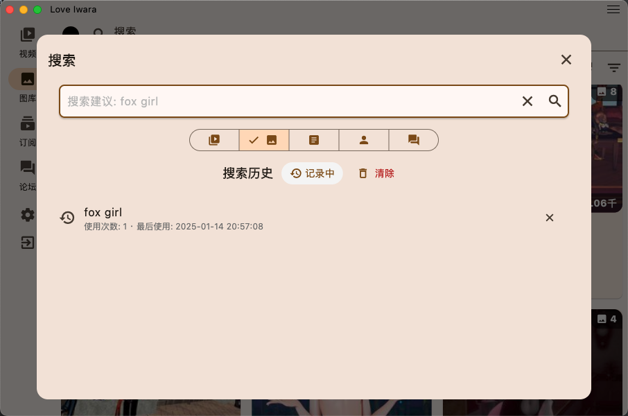
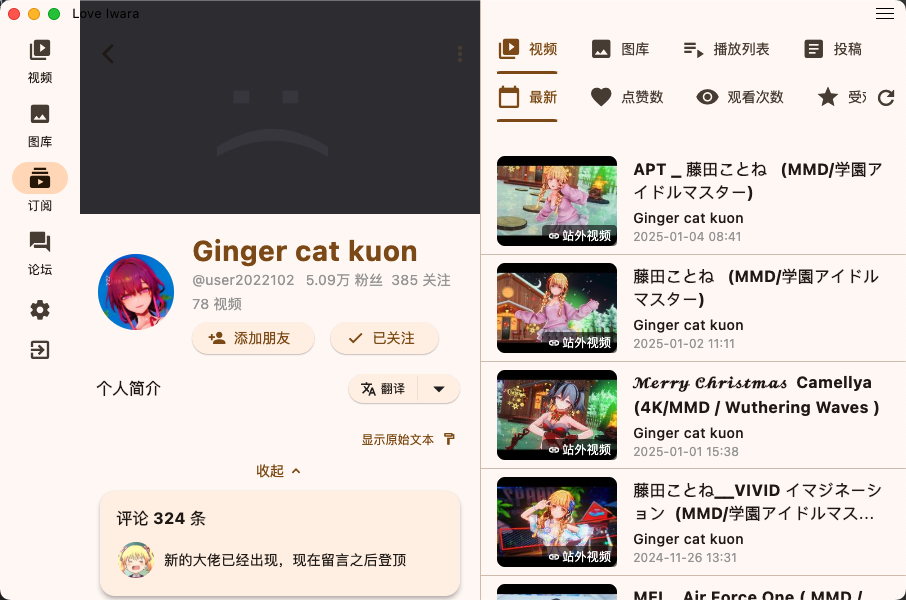

# Love Iwara (2i)

  

[English](#english) | [中文](README_ZH.md)

---

## English

### 🌟 Introduction
Love Iwara (also known as i_iwara or 2i) is a third-party mobile application for Iwara built with Flutter. Our goal is to provide users with an excellent experience, supporting multiple platforms and devices including mobile phones, tablets and computers, compatible with Android, Windows and other operating systems.

### ⚠️ Project Description
As a Flutter beginner, this is my first attempt at developing a cross-platform application. While there may be areas in the project that need improvement and code that could be optimized, the main purpose is to learn and understand Flutter development through hands-on practice.

- **Learning Objectives**
  - Familiarize with Flutter development basics
  - Understand cross-platform application development processes
  - Document insights and experiences during the learning process

- **Project Status**
  - Currently in the learning and exploration phase
  - Code may not be sufficiently standardized and complete
  - Feature implementation primarily focuses on learning purposes

- **Usage Notes**
  - This project is for learning reference only
  - Not recommended for production environment
  - Welcome discussions with other learners

- **Usage Restrictions**
  - Strictly prohibited from promotion on any platform
  - Violations will result in measures including but not limited to maintenance suspension and repository deletion

- **Known Issues**
  - Due to limited experience, the project may have room for performance optimization
  - Some features may not be fully developed
  - On Android, Impeller rendering has been disabled due to severe performance issues. This might pose a hidden risk for future updates, and the root cause is currently unknown. To re-enable Impeller, you can add `<meta-data android:name="flutter.embedding.android.EnableImpeller" android:value="true" />` within the `<application>` tag in `android/app/src/main/AndroidManifest.xml`. If you have insights or solutions, please feel free to submit a PR, open an [Issues](https://github.com/FoxSensei001/i_iwara/issues), or discuss it in the [Communication Group](https://t.me/+OtpMbe9DkjYzMGM1).
  - Suggestions for improvement are welcome

Thank you for your understanding and support! If you're also a Flutter beginner, I hope we can progress together in our learning journey.

### ✨ Features
#### Current Features
- **🖥️ Supported Platforms**
    - 📱 Android
    - 🪟 Windows
    - 🍎 MacOS (Due to lack of Mac device, testing unavailable;)
    - 🐧 Linux (Due to lack of Linux device, testing unavailable)
    - 📱 iOS (Due to lack of iOS device, testing unavailable)
    - 🌐 Web (Development only)

- **🔍 Search**
    - Search videos/galleries/posts/users/forums

- **📜 History**
    - Browsing history: videos/galleries/posts/forums
- **📜 Local Favorite**
    - Favorite folder
    - Local favorite
- **🔍 Download (Test Version)**
    - Download videos/galleries/single files

- **🔄 Translation**
    - Translate video descriptions/gallery descriptions/posts/comments/forums/conversations, etc.

- **🎥 Video**
    - Video playback
    - Video tags
    - Video quality selection
    - Playback speed control
    - Fullscreen support

- **🖼️ Gallery**
    - Image browsing
    - Image zoom and pan
    - Gallery view

- **📝 Posts**
    - Browse/comment

- **🗣️ Forum System**
    - Publish/edit posts
    - Publish/edit replies

- **📜 Comments**
    - Comment browsing
    - Comment reply
- **📜 Local Favorite**
    - Favorite folder
    - Local favorite

- **📩 Private Messages**
    - Private message browsing
    - Private message reply

- **🔔 In-app Message Notifications**
    - Message notification browsing
    - Message notification reply

- **👤 User System**
    - User authentication
    - Profile management
    - Following system
- **🔗 Share**
    - Share video/gallery/post/thread/user
    - Android app jump (Only Android, other apps will jump to the app to continue browsing when trying to open the link)

- **🌍 Multi-language Support**
    - English
    - Simplified Chinese
    - Traditional Chinese
    - Japanese

- **🔍 More features to be discovered**

#### Upcoming Features
- **Temporary no new features planned, you can submit your ideas in the [Issues](https://github.com/FoxSensei001/i_iwara/issues) or [Communication Group](https://t.me/+OtpMbe9DkjYzMGM1)**
- **Enhanced User Experience**
- **Others**

### 📱 Communication Group
Click [here](https://t.me/+OtpMbe9DkjYzMGM1) to join the communication group.

### 📱 Screenshots
| | |
|:-------------------------:|:-------------------------:|
|||
|||
|||
|||
|||
|||
|||
|||
|||
|||

### 🛠️ Development Environment Setup

#### Prerequisites
- Flutter SDK (Latest stable version recommended)
- Dart SDK
- Git
- Recommended IDEs:
  - Android Studio / Cursor
  - VS Code / Cursor + Flutter plugin
- Check the [pubspec.yaml](pubspec.yaml) for more dependencies. Some of them needs to run some magic commonds to prepare your environment.

#### Platform-Specific Requirements

**Windows Development Environment:**
- Windows 10 or higher (64-bit)
- Visual Studio 2022 or newer
- Windows 10 SDK