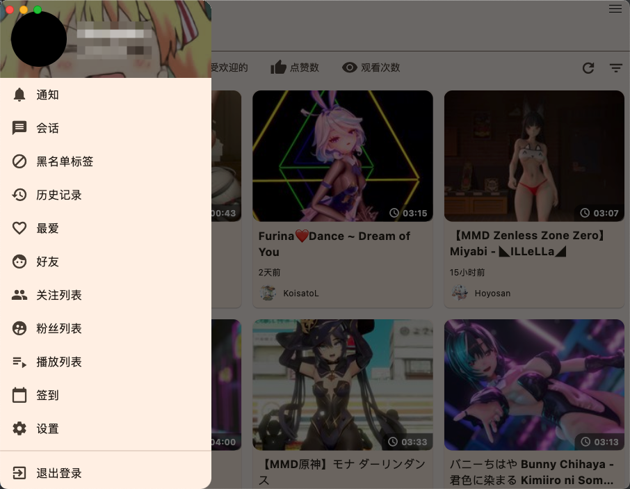
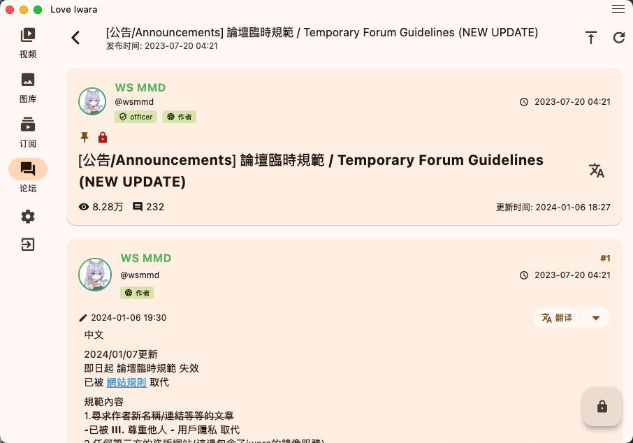
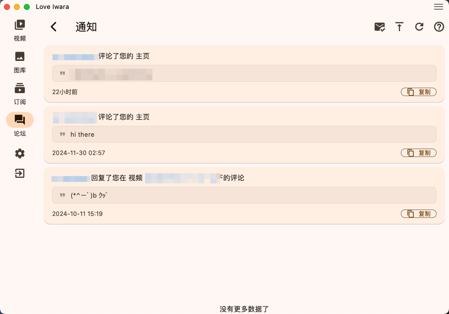

<div align="center">

<a href="https://github.com/FoxSensei001/LoveIwara">
    
</a>

# Love Iwara (2i)

[](https://t.me/+OtpMbe9DkjYzMGM1)
[](https://github.com/FoxSensei001/LoveIwara)
[](https://github.com/FoxSensei001/LoveIwara)
[](LICENSE)
[](https://github.com/FoxSensei001/LoveIwara/issues)

[English](README.md) | [中文](#中文)

</div>

---

## 中文

### 🌟 简介
Love Iwara（又名 i_iwara 或 2i）是一个使用 Flutter 构建的 Iwara 第三方移动应用。我们的目标是为用户提供出色的使用体验，支持多种平台和设备，包括手机、平板电脑和计算机，兼容 Android、Windows、macOS、Linux 和 iOS 等操作系统。

### ⚠️ 项目说明
作为一名 Flutter 新手，这是我第一次尝试开发跨平台应用。项目中可能存在不少不规范的地方，代码也有待优化，但主要目的是通过实践来学习和理解 Flutter 开发。

- **学习目的**
  - 熟悉 Flutter 开发基础
  - 理解跨平台应用开发流程
  - 记录学习过程中的心得体会

- **项目状态**
  - 目前处于学习探索阶段
  - 代码可能不够规范完善
  - 功能实现以学习为主要目的

- **使用提醒**
  - 本项目仅供学习参考
  - 不建议用于生产环境
  - 欢迎其他学习者交流讨论

- **使用限制**
  - 严禁在任何平台进行宣传推广
  - 如有违反，将采取包括但不限于停止维护、删除仓库等措施

- **已知问题**
  - 由于经验有限，项目可能存在性能优化空间
  - 部分功能可能不够完善
  - 在 Android 平台上，由于 Impeller 渲染引擎存在严重性能问题，目前已默认禁用。这可能会影响未来的版本更新。如需重新启用，请修改 `android/app/src/main/AndroidManifest.xml` 文件，在 `<application>` 节点中添加 `<meta-data android:name="flutter.embedding.android.EnableImpeller" android:value="true" />`。如果您有任何优化建议或解决方案，欢迎通过提交 PR、创建 [Issues](https://github.com/FoxSensei001/i_iwara/issues) 或加入 [交流群组](https://t.me/+OtpMbe9DkjYzMGM1) 参与讨论。
  - 欢迎提出建议帮助改进

感谢理解与支持！如果你也是 Flutter 初学者，希望我们能在学习过程中共同进步。

### ✨ 功能特性
#### 当前功能
- **🖥️ 支持平台**
    - 📱 Android
    - 🪟 Windows
    - 🍎 MacOS
    - 🐧 Linux（由于没有 Linux 设备，暂无法测试）
    - 📱 iOS（由于没有属于自己的 iOS 设备，暂无法测试）


- **🔍 搜索**
    - 搜索视频/图库/帖子/用户/论坛

- **📜 历史记录(仅限本地)**
    - 浏览历史: 视频/图库/帖子/论坛
- **📜 收藏(仅限本地)**
    - 收藏夹
    - 本地收藏
- **🔍 下载(测试版)**
    - 下载视频/图库/单文件

- **🔄 翻译**
    - 翻译视频描述/图库描述/帖子/评论/论坛/会话等

- **🎥 视频**
    - 视频播放
    - 视频标签
    - 视频清晰度选择
    - 播放速度控制
    - 全屏支持
    - 桌面端支持拖拽视频文件到应用窗口直接播放

- **🖼️ 图库**
    - 图片浏览
    - 图片缩放和平移
    - 图库视图

- **📝 帖子**
    - 浏览/评论

- **🗣️ 论坛系统**
    - 发布/编辑帖子
    - 发表/编辑回复

- **📜 评论**
    - 评论浏览
    - 评论回复

- **📩 私信**
    - 私信浏览
    - 私信回复

- **🔔 站内消息通知**
    - 消息通知浏览
    - 消息通知回复

- **👤 用户系统**
    - 用户认证
    - 个人资料管理
    - 关注系统

- **🌍 分享**
    - 分享视频/图库/帖子/论坛/用户
    - 安卓应用跳转(仅限安卓, 其他应用尝试打开超链接时会跳转到应用继续浏览)

- **🌍 多语言支持**
    - 英语
    - 简体中文
    - 繁体中文
    - 日语

- **🔍 更多待发现功能**

#### 即将推出的功能
- **暂无新功能打算，您可以在 [Issues](https://github.com/FoxSensei001/i_iwara/issues) 或 [交流群](https://t.me/+OtpMbe9DkjYzMGM1) 提出您的想法**
- **增强用户体验**
- **其他**

### 📱 交流群

加入我们的 Telegram 社区：点击 [此处](https://t.me/+OtpMbe9DkjYzMGM1) 加入交流群。

### 📱 截图展示
| | |
|:-------------------------:|:-------------------------:|
|||
|||
|||
|||
|||
|||
|||
|||
|||
|||

### 🛠️ 开发环境设置

#### 前置要求
- Flutter SDK (建议最新稳定版)
- Dart SDK
- Git
- IDE 推荐:
  - Android Studio / Cursor
  - VS Code / Cursor + Flutter 插件
- 检查 [pubspec.yaml](pubspec.yaml) 以了解项目里用到了什么依赖，某些依赖项需要运行一些邪门的命令来准备环境。

#### 平台特定要求

**Windows 开发环境:**
- Windows 10 或更高版本 (64-bit)
- Visual Studio 2022 或更新版本
- Windows 10 SDK
```bash
# 检查 Windows 开发环境
flutter doctor -v
```

**macOS 开发环境:**
- macOS (最新版本推荐)
- Xcode (最新版本)
- CocoaPods
```bash
# 安装 CocoaPods
sudo gem install cocoapods
```

**Linux 开发环境:**
```bash
# Ubuntu/Debian
sudo apt-get install clang cmake ninja-build pkg-config libgtk-3-dev liblzma-dev

# Fedora
sudo dnf install clang cmake ninja-build gtk3-devel
```

**Android 开发环境:**
- Android Studio
- Android SDK
- Android 模拟器或实体设备

**iOS 开发环境:**
- Xcode
- iOS 模拟器或实体设备
- Apple 开发者账号（发布需要）

#### 项目设置
```bash
# 1. 克隆仓库
git clone [仓库地址]
cd [项目目录]

# 2. 检查 Flutter 环境
flutter doctor

# 3. 获取依赖
flutter pub get

# 4. 启动开发
# 运行在默认设备上
flutter run

# 指定平台运行
flutter run -d windows  # Windows
flutter run -d macos   # macOS
flutter run -d linux   # Linux

flutter run -d android # Android
flutter run -d ios     # iOS

# 5. 构建发布版本
# Android
flutter build apk --release
flutter build appbundle --release

# iOS
flutter build ios --release

# Windows
flutter build windows --release

# macOS
flutter build macos --release

# Linux
flutter build linux --release


```

#### 常用开发命令
```bash
# 生成国际化文本
dart run slang

# 清理构建缓存
flutter clean

# 更新 Flutter SDK
flutter upgrade

# 分析代码
flutter analyze

# 运行测试
flutter test

# 查看已连接设备
flutter devices

# 创建新页面/组件
flutter create component_name
```

#### 注意事项
1. 确保各平台的开发环境正确配置
2. iOS 开发需要 macOS 系统
3. 定期更新 Flutter SDK 和依赖
4. 使用 `.gitignore` 排除不必要的文件
5. 遵循 Flutter 官方的最佳实践指南

#### 常见问题解决
```bash
# 依赖冲突解决
flutter pub cache repair
flutter clean
flutter pub get

# 模拟器问题
flutter emulators
flutter emulators --launch <emulator_id>

# 开发工具重置
flutter config --clear-features
```
这些设置涵盖了 Flutter 全平台开发的主要方面。根据具体项目需求，可能需要额外的配置或工具。建议定期查看 Flutter 官方文档以获取最新的开发指南和最佳实践。

### 🌍 国际化
目前项目的国际化文本主要通过 GPT 生成。如果您愿意协助改进翻译，请参考简体中文模板文件：[lib/i18n/zh-CN.i18n.yaml](lib/i18n/zh-CN.i18n.yaml)。

### 💬 反馈建议
如果您有任何建议或发现任何 bug，欢迎在项目的 issues 区提交反馈。

### 🙏 致谢

#### 感谢以下优秀项目的启发

本项目的开发过程中受到了以下优秀项目的启发，项目中的许多实现方式和最佳实践都是从这些仓库中学习得来。

<div align="center">

<table>
  <tr>
    <td align="center" width="50%">
      <a href="https://github.com/iwrqk/iwrqk">
        
      </a>
      <br />
      <sub><b>iwrqk/iwrqk</b></sub>
      <br />
      <sub>优秀的 Flutter 实现的 Iwara 客户端</sub>
    </td>
    <td align="center" width="50%">
      <a href="https://github.com/wgh136/PicaComic">
        
      </a>
      <br />
      <sub><b>wgh136/PicaComic</b></sub>
      <br />
      <sub>结构良好的 Flutter 漫画应用</sub>
    </td>
  </tr>
</table>

</div>

#### 项目贡献者

感谢所有为本项目做出贡献的开发者！

<div align="center">

<a href="https://github.com/FoxSensei001/LoveIwara/graphs/contributors">
  
</a>

</div>

<sub>通过 [contrib.rocks](https://contrib.rocks) 生成</sub>

### 🤝 贡献

欢迎提交 Pull Request！对于重大更改，请先打开一个 issue 来讨论您想要更改的内容。

在报告新问题之前，请查看已打开的 [issues](https://github.com/FoxSensei001/LoveIwara/issues)；如果您有任何问题，请加入我们的 [Telegram 群组](https://t.me/+OtpMbe9DkjYzMGM1)。

### ⚠️ 免责声明

本应用的开发者与 Iwara 或其内容提供商没有任何关联，本应用不托管任何内容。 

## Android 签名配置

在构建 Android 版本之前，需要配置正确的签名信息来生成正式发布的 APK，请按照以下步骤操作：

1. **生成 keystore 文件**

   在项目的 `android/app` 目录下打开终端，执行以下命令（请替换 `<your_key_alias>` 及其他参数为你自己的信息）：
   ```bash
   keytool -genkeypair -v -keystore keystore.jks -alias <your_key_alias> -keyalg RSA -keysize 2048 -validity 10000
   ```
   该命令将在当前目录生成一个名为 `keystore.jks` 的文件，请确保该文件位于 `android/app` 目录下。

2. **配置签名信息**

   请检查 `android/app/build.gradle` 文件中的签名配置，确保配置如下：
   ```groovy
   signingConfigs {
       release {
           storeFile file("keystore.jks")
           storePassword System.getenv("KEYSTORE_PASSWORD") ?: project.findProperty("MY_KEYSTORE_PASSWORD")
           keyAlias System.getenv("KEY_ALIAS") ?: project.findProperty("MY_KEY_ALIAS")
           keyPassword System.getenv("KEY_PASSWORD") ?: project.findProperty("MY_KEY_PASSWORD")
       }
   }
   ```
   同时，在 `android/gradle.properties` 文件中确保包含以下占位符：
   ```properties
   MY_KEYSTORE_PASSWORD=${KEYSTORE_PASSWORD}
   MY_KEY_ALIAS=${KEY_ALIAS}
   MY_KEY_PASSWORD=${KEY_PASSWORD}
   ```
   这样可以确保签名信息能通过系统环境变量注入，或者在本地直接配置实际值（建议仅用于调试环境）。

3. **GitHub Actions 配置**

   为了在 GitHub Actions 上自动构建签名的 APK，需要做以下准备工作：
   - 将 `keystore.jks` 文件转换为 Base64 编码后的字符串，然后在仓库的 Secrets 中添加一个 Secret（例如命名为 `KEYSTORE_BASE64`）。
   - 同时，在仓库 Secrets 中添加以下条目：
     - `KEYSTORE_PASSWORD`（你的 keystore 密码）
     - `KEY_ALIAS`（签名使用的别名）
     - `KEY_PASSWORD`（你的密钥密码）

   在工作流文件（如 `.github/workflows/build.yml`）中，配置环境变量及还原 keystore 文件的步骤示例如下：
   ```yaml
   env:
     KEYSTORE_PASSWORD: ${{ secrets.KEYSTORE_PASSWORD }}
     KEY_ALIAS: ${{ secrets.KEY_ALIAS }}
     KEY_PASSWORD: ${{ secrets.KEY_PASSWORD }}
   
   steps:
     - name: Setup Keystore
       run: |
         echo "${{ secrets.KEYSTORE_BASE64 }}" | base64 --decode > android/app/keystore.jks
       shell: bash
   ```

4. **构建命令**

   配置完成后，在项目根目录下执行：
   ```bash
   flutter build apk --release
   ```
   成功构建后，生成的 APK 将位于 `build/app/outputs/flutter-apk/app-release.apk`。

按照以上步骤配置后，即可生成并使用签名的 Android APK 用于发布或后续覆盖安装。
