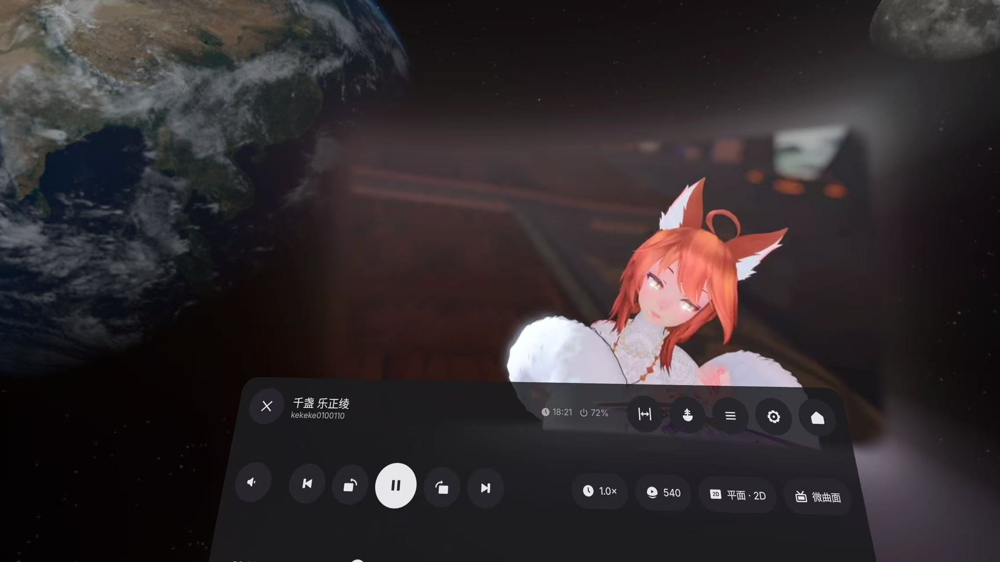

<div align="center">

<a href="https://github.com/FoxSensei001/LoveIwara">
    
</a>

# Love Iwara <sup>(2i)</sup>

**Klien pihak ketiga untuk Iwara yang cepat, indah, dan lintas platform, dibangun dengan Flutter.**

Satu basis kode → Android · Meta Quest · Windows · macOS · Linux · iOS

[](https://t.me/+ITH4CV6Z_sc2ZWVl)
[](https://github.com/FoxSensei001/LoveIwara)
[](https://github.com/FoxSensei001/LoveIwara)
[](https://github.com/FoxSensei001/LoveIwara/releases/latest)
[](https://github.com/FoxSensei001/LoveIwara/releases)
[](../../LICENSE)
[](https://github.com/FoxSensei001/LoveIwara/issues)


[English](../../README.md) · [日本語](README_JA.md) · [简体中文](README_ZH.md) · [繁體中文](README_ZH_TW.md) · [한국어](README_KO.md) · [ภาษาไทย](README_TH.md) · **Bahasa Indonesia** · [Tiếng Việt](README_VI.md) · [Español](README_ES.md) · [Русский](README_RU.md) · [Français](README_FR.md) · [Deutsch](README_DE.md)

</div>

---

## 🌟 Pengantar

**Love Iwara** (juga dikenal sebagai `i_iwara` atau **2i**) adalah klien pihak ketiga untuk [Iwara](https://www.iwara.tv) yang dibangun dengan Flutter. Tujuannya adalah memberikan pengalaman yang mulus dan terasa native di ponsel, tablet, dan desktop — semuanya dari satu basis kode yang mencakup **Android, Meta Quest, Windows, macOS, Linux, dan iOS**.

> [!NOTE]
> Proyek ini dimulai sebagai proyek belajar — upaya pertama saya membuat aplikasi Flutter lintas platform. Sebagian kode mungkin belum sepenuhnya rapi, tetapi proyek ini dipelihara secara aktif dan penuh dengan fitur. Jika kamu juga sedang belajar Flutter, saya berharap kita bisa berkembang bersama. PR dan masukan selalu diterima dengan senang hati!

> [!IMPORTANT]
> **Batasan penggunaan** — Proyek ini hanya untuk keperluan belajar dan referensi pribadi, dan **tidak direkomendasikan untuk digunakan di lingkungan produksi**. **Promosi proyek ini di platform publik mana pun sangat dilarang.** Pelanggaran dapat menyebabkan pemeliharaan dihentikan dan repository dihapus.

> [!WARNING]
> **Penafian** — Pengembang tidak memiliki afiliasi apa pun dengan Iwara atau penyedia kontennya. Aplikasi ini **tidak** menghosting konten miliknya sendiri sama sekali.

## ✨ Fitur

### 🖥️ Platform
| Android | Meta Quest | Windows | macOS | Linux | iOS |
|:---:|:---:|:---:|:---:|:---:|:---:|
| ✅ | ✅ *APK terpisah¹* | ✅ | ✅ | ⚠️ *belum diuji²* | ✅ |

<sub>¹ Build Quest adalah APK arm64 tersendiri untuk Horizon OS (Android 14+) yang membawa Meta Spatial SDK — lihat [Meta Quest / VR](#-meta-quest--vr). APK Android biasa tidak terpengaruh dan tetap mendukung Android 7.0+.</sub>
<sub>² Build Linux dihasilkan, tetapi saat ini belum diuji karena kurangnya perangkat uji.</sub>

### 🎥 Video
- Pemutaran mulus berkat **media_kit** (libmpv)
- Pemilihan kualitas · kontrol kecepatan pemutaran (termasuk kecepatan default/otomatis) · layar penuh
- Thumbnail **pratinjau seek** saat mengarahkan kursor atau menyeret pada bilah progres
- **Stempel waktu yang dapat diklik** — langsung lompat ke momen tertentu dari stempel waktu yang disorot pada deskripsi dan komentar
- Panel **"Lanjutkan menonton"** + pemutaran otomatis opsional saat masuk ke video
- Indikator kecepatan pemuatan secara real-time
- **Penampil panorama pada layar datar** — file VR180 / 360° biasanya ditampilkan sebagai dua bagian yang gepeng; di sini kamu mendapatkan viewport dengan proporsi yang benar dan bisa diseret untuk melihat sekeliling. File dari Iwara sama sekali tidak membawa metadata spherical, sehingga formatnya ditebak secara heuristik — koreksi secara manual dan koreksi itu akan diingat untuk video tersebut
- **"Jarak pandang"** — tekan dan tahan untuk mendorong gambar menjauh atau menariknya lebih dekat (zoom gambar untuk video datar, field of view untuk video panorama)
- **Buka di aplikasi lain** — kirim video saat ini ke MX Player / VLC, ke pemutar VR seperti Skybox atau Pigasus, atau ke pemutar eksternal kustom di desktop; mengutamakan file lokal atau yang sudah diunduh, dengan "salin tautan" sebagai cadangan
- Desktop: **seret dan lepas** file video lokal ke jendela untuk langsung diputar

### 🥽 Meta Quest / VR
*Dirilis sebagai APK `quest` terpisah yang dibangun di atas Meta Spatial SDK. Build Android biasa sama sekali tidak terhubung dengannya, dan `minSdk`-nya tetap tidak berubah.*

**Aplikasi ini hidup dalam lingkungan spasial.** Meluncur dari beranda Quest langsung membawamu ke ruang imersif yang menetap. Seluruh aplikasi — menjelajah, mencari, komentar, keyboard di layar — melayang di depanmu sebagai panel 2D; tidak ada bagian yang dipotong. Panelnya **melengkung dengan lembut** (busur 30° — kurang lebih seperti monitor kelengkungan "3000R" pada lebar default 1,6 m). Yang tetap adalah busurnya, bukan radiusnya, jadi kelengkungannya terlihat sama betapapun lebar atau sempitnya kamu menarik jendela.

**Tiga jendela, satu set gestur.** Panel aplikasi, layar, dan panel kontrol masing-masing memiliki bingkainya sendiri: grip trigger menyeret jendela dari badannya, tepi menyeretnya, sudut mengubah ukurannya di sekitar pusatnya, dan jendela selalu menghadapmu. Ukuran dan posisi diingat. Tidak ada yang muncul sampai head tracking stabil — tidak ada jendela yang muncul sekilas di tempat yang salah lalu meloncat.

**Pemutar menjadi layar dalam ruang.** Buka sebuah video dan ia akan beralih secara otomatis (opsional).
- **Bentuk layar** — datar, atau tiga tingkat kelengkungan. Jarak, lebar, dan rasio aspek dapat disesuaikan dan diingat *per rasio aspek*, jadi saat kembali ke klip 4:3, tata letak yang kamu atur untuk 4:3 akan dipulihkan.
- **Format video** — 2D / 3D, side-by-side setengah & penuh, over-under setengah & penuh, equirectangular 180° dan 360°; terdeteksi otomatis dari file dan bisa dikoreksi manual. EAC dan fisheye dikenali, diberi label tidak didukung, dan sebagai gantinya ditawarkan untuk dibuka di pemutar eksternal.
- **Pemutaran** — kecepatan 0,5×–3,0×, loop, volume, pratinjau scrub yang menampilkan waktu target dan selisihnya, indikator buffering langsung di layar, ditambah jam dan baterai di panel.
- **"Lanjutkan menonton", di dalam ruang** — kumpulan video terbagi seksi yang sama seperti di aplikasi 2D (daftar sumber, langganan, playlist, favorit, unduhan, tonton nanti), lengkap dengan sampul. Ganti video tanpa perlu keluar dari ruang; panel akan menampilkan status memuat dan mengembalikan video lama jika video berikutnya gagal dimuat.
- **Tautan kedaluwarsa ditangani** — sumber disegarkan sebelum kedaluwarsa, dan error 404 di tengah pemutaran akan memicu penyegaran lalu melanjutkan dari titik terakhir.
- **Scene** — passthrough, atau ruang kosong.

**Galeri spasial.** Galeri terbuka sebagai satu panggung besar ditambah strip film, sehingga sekumpulan puluhan gambar — dan video yang tercampur di antaranya — tetap menjadi satu objek, bukan puluhan lapisan. Slideshow pada 3 / 5 / 10 / 20 detik, kualitas standar atau asli, dan seret ke samping pada panggung untuk membalik. Gambar potret disesuaikan ke dalam kotak 16:9 agar ilustrasi 9:16 tidak menjulang di atasmu.

**Tangan atau kontroler.**
- *Tangan* — ray resmi dan cubitan (pinch). Cubitan di mana saja di luar panel akan mengaktifkan/menonaktifkan panel kontrol.
- *Kontroler* — A/X putar/jeda, B/Y menutup panel atau kembali ke aplikasi, Menu membuka pengaturan. Grip trigger dapat menangkap layar tanpa perlu membidiknya. Stick men-scrub kiri/kanan dengan akselerasi (satu dorongan adalah 5 detik; ditahan, akan berakselerasi hingga 15 menit per detik) dan mendorong layar lebih dekat atau lebih jauh ke atas/bawah.
- Melepas headset akan menjeda pemutaran, dan memakainya kembali akan melanjutkannya; recenter sistem akan menata ulang semuanya di depanmu.

**Penggunaan pertama dimulai dengan sebuah pelajaran.** Panduan awal headset ini bukan versi layar sentuh yang dibawa begitu saja ("cubit untuk zoom, tahan untuk kecepatan") — tidak ada gambar yang bisa disentuh di dalam ruang. Sebagai gantinya ada dua kursus, **video spasial** dan **galeri spasial**: ilustrasi kontroler dianimasikan frame demi frame bersama tombol dan sticknya, layar, panel, dan ray ditempatkan pada geometri sebenarnya, dan setiap gerakan ditampilkan baik untuk kontroler *maupun* tangan kosong. Dengan opsi sistem "kurangi gerakan" aktif, sebagai gantinya akan ditampilkan satu frame diam yang informatif. Dapat diputar ulang kapan saja dari pengaturan.

### 🌐 Jelajahi & Temukan
- **Pencarian** multi-kategori: video · galeri · postingan · pengguna · forum
- **Pergantian situs** antara `iwara.tv` dan `iwara.ai` saat aplikasi berjalan
- Integrasi feed **berita** (`news.iwara.tv`)
- Integrasi sumber tag **Oreno3d** untuk pemberian tag video yang lebih kaya
- Langganan, penyaringan yang kaya, dan tata letak responsif untuk desktop/tablet

### 🖼️ Galeri
- Penjelajahan gambar dengan zoom & pan yang mulus
- Penampil galeri dengan pengaturan kualitas

### 💬 Komunitas
- **Forum**: membuat & mengedit thread dan balasan
- **Postingan**: jelajahi & beri komentar
- **Komentar**: jelajahi & balas
- **Pesan pribadi**: jelajahi & balas
- **Notifikasi dalam aplikasi**: jelajahi & balas

### 👤 Akun & Berbagi
- Autentikasi pengguna, manajemen profil, sistem mengikuti
- **Bagikan** video / galeri / postingan / thread / pengguna
- Penerusan deep-link Android: membuka tautan Iwara di aplikasi lain akan melompat kembali ke 2i

### 🗂️ Data Lokal & Utilitas
- **Riwayat** (lokal): video · galeri · postingan · forum
- **Favorit lokal** dengan folder favorit kustom
- **Unduhan** *(beta)*: video / galeri / file tunggal, dengan jalur kustom (termasuk kartu SD/TF eksternal di Android)
- **Cadangkan & pulihkan**: ekspor/impor konfigurasi dan riwayat
- **Terjemahan** deskripsi, postingan, komentar, forum, percakapan, dan lainnya
- **Kunci aplikasi** dengan PIN / biometrik
- Opsi "Ingat volume terakhir" (PC)

### 🌍 Multibahasa
**UI mendukung 12 bahasa** — English · 简体中文 · 繁體中文 · 日本語 · 한국어 · ภาษาไทย · Bahasa Indonesia · Tiếng Việt · Español · Русский · Français · Deutsch — termasuk panel spasial di Quest, yang mengikuti bahasa aplikasi, bukan bahasa sistem. Nama tag Iwara/Oreno3d hanya diterjemahkan untuk sebagian kecil dari bahasa-bahasa ini — lihat [di bawah](#-internasionalisasi).

> Menemukan hal lain? Masih ada lebih banyak fitur tersembunyi untuk ditemukan — dan lebih banyak lagi yang sedang dikembangkan. Punya ide? Buka [Issue](https://github.com/FoxSensei001/LoveIwara/issues) atau mampir ke [grup Telegram](https://t.me/+ITH4CV6Z_sc2ZWVl).

## 🗺️ Roadmap

**Dukungan Quest sudah hadir** — lihat [Meta Quest / VR](#-meta-quest--vr) di atas. Ini dirilis sebagai APK tersendiri, dihasilkan oleh job CI-nya sendiri, dan build Android biasa tidak tersentuh.

Yang masih terbuka di sisi headset:

- Jalur pelepasan memori GPU untuk panel spasial belum berjalan efektif.
- Scene spasial berbagi thread utama dengan Flutter; biaya frame dari hal ini belum pernah diukur.
- Panel aplikasi saat ini berbasis Activity dan seharusnya dimigrasikan ke panel berbasis View, yang menurut panduan resmi disebut lebih ringan di antara keduanya.
- Proyeksi EAC dan fisheye terdeteksi tetapi diserahkan ke pemutar eksternal alih-alih dirender.

Di tempat lain: unduhan masih ditandai beta, dan Linux dibuild tetapi belum diuji karena kurangnya mesin uji.

Punya permintaan? Buka [Issue](https://github.com/FoxSensei001/LoveIwara/issues) atau mampir ke [grup Telegram](https://t.me/+ITH4CV6Z_sc2ZWVl).

## 🧰 Tech Stack

| Area | Library |
|---|---|
| Framework | **Flutter** + Dart |
| Manajemen state | **GetX** (`get`) |
| Routing | **go_router** |
| Jaringan | **Dio** (+ interceptor CookieJar / Cloudflare) |
| Video | **media_kit** (libmpv) |
| Persistensi | **sqlite3** · **get_storage** · **flutter_secure_storage** |
| i18n | **slang** |
| Shell desktop | **window_manager** (title bar kustom, seret & lepas) |

## 📸 Tangkapan Layar

### 🥽 Meta Quest

| Layar dan panel kontrolnya | Sebuah galeri: satu panggung ditambah strip film |
|:-------------------------:|:-------------------------:|
|||

### 📱 Ponsel & Desktop

| | |
|:-------------------------:|:-------------------------:|
|||
|||
|||
|||
|||
|||
|||
|||
|||
|||

## 🚀 Mulai Cepat

```bash
# 1. Clone
git clone https://github.com/FoxSensei001/LoveIwara.git
cd LoveIwara

# 2. Periksa toolchain kamu
flutter doctor

# 3. Instal dependency
flutter pub get

# 4. Jalankan (otomatis memilih perangkat yang terhubung)
flutter run --flavor standard   # Android memerlukan flavor — lihat catatan di bawah
# …atau targetkan sebuah platform (desktop/iOS tidak memerlukan flavor):
flutter run -d windows   # macos / linux / ios
```

> [!IMPORTANT]
> **Android dirilis dengan dua product flavor.** `standard` adalah build biasa untuk ponsel/tablet (`minSdk 24`,
> semua ABI); `quest` adalah build untuk Meta Quest / Horizon OS (`minSdk 34`, hanya arm64, membawa
> Meta Spatial SDK berukuran ~50 MB). Begitu flavor ada, AGP tidak lagi memiliki varian "tanpa flavor", jadi
> **setiap `flutter run` / `flutter build` Android harus menyertakan `--flavor`** — perintah polos akan langsung gagal.

> [!TIP]
> Setelah mengedit file `lib/i18n/*.i18n.yaml` mana pun, buat ulang string lokalisasi dengan `dart run slang`.
> Lihat [`pubspec.yaml`](../../pubspec.yaml) untuk daftar dependency lengkap — beberapa paket memerlukan langkah pengaturan tambahan.

<details>
<summary><b>🛠️ Pengaturan lingkungan pengembangan lengkap</b></summary>

### Prasyarat
- Flutter SDK (disarankan versi stable terbaru) · Dart SDK · Git
- IDE yang disarankan: Android Studio / VS Code / Cursor + plugin Flutter

### Persyaratan khusus platform

**Windows**
- Windows 10+ (64-bit), Visual Studio 2022+, Windows 10 SDK
```bash
flutter doctor -v
```

**macOS**
- macOS terbaru + Xcode + CocoaPods
```bash
sudo gem install cocoapods
```

**Linux**
```bash
# Ubuntu/Debian
sudo apt-get install clang cmake ninja-build pkg-config libgtk-3-dev liblzma-dev
# Fedora
sudo dnf install clang cmake ninja-build gtk3-devel
```

**Android** — Android Studio + Android SDK + emulator/perangkat
**iOS** — Xcode + simulator/perangkat + akun Apple Developer (untuk publikasi)

### Build binary rilis
```bash
flutter build apk --release --flavor standard         # Android APK (ponsel / tablet)
flutter build appbundle --release --flavor standard   # Android AAB
flutter build apk --release --flavor quest --target-platform android-arm64   # Meta Quest APK
flutter build ios --release          # iOS
flutter build windows --release      # Windows
flutter build macos --release        # macOS
flutter build linux --release        # Linux
```

### Perintah yang berguna
```bash
dart run slang     # buat ulang string i18n
flutter analyze    # lint
flutter test       # jalankan test
flutter clean      # bersihkan cache build
flutter devices    # daftar perangkat yang terhubung
```

### Pemecahan masalah
```bash
# Konflik dependency
flutter pub cache repair && flutter clean && flutter pub get
# Emulator
flutter emulators && flutter emulators --launch <emulator_id>
```

</details>

<details>
<summary><b>🔐 Konfigurasi penandatanganan Android</b></summary>

Untuk membuat APK rilis yang ditandatangani:

**1. Buat keystore** (jalankan di dalam `android/app`):
```bash
keytool -genkeypair -v -keystore keystore.jks -alias <your_key_alias> -keyalg RSA -keysize 2048 -validity 10000
```
Pastikan `keystore.jks` berada di `android/app`.

**2. Konfigurasikan penandatanganan** di `android/app/build.gradle`:
```groovy
signingConfigs {
    release {
        storeFile file("keystore.jks")
        storePassword System.getenv("KEYSTORE_PASSWORD") ?: project.findProperty("MY_KEYSTORE_PASSWORD")
        keyAlias System.getenv("KEY_ALIAS") ?: project.findProperty("MY_KEY_ALIAS")
        keyPassword System.getenv("KEY_PASSWORD") ?: project.findProperty("MY_KEY_PASSWORD")
    }
}
```
Lalu tambahkan placeholder ke `android/gradle.properties`:
```properties
MY_KEYSTORE_PASSWORD=${KEYSTORE_PASSWORD}
MY_KEY_ALIAS=${KEY_ALIAS}
MY_KEY_PASSWORD=${KEY_PASSWORD}
```

**3. GitHub Actions** — tambahkan Secrets repository: `KEYSTORE_BASE64` (base64 dari `keystore.jks`), `KEYSTORE_PASSWORD`, `KEY_ALIAS`, `KEY_PASSWORD`. Lalu di `.github/workflows/build.yml`:
```yaml
env:
  KEYSTORE_PASSWORD: ${{ secrets.KEYSTORE_PASSWORD }}
  KEY_ALIAS: ${{ secrets.KEY_ALIAS }}
  KEY_PASSWORD: ${{ secrets.KEY_PASSWORD }}

steps:
  - name: Setup Keystore
    run: |
      echo "${{ secrets.KEYSTORE_BASE64 }}" | base64 --decode > android/app/keystore.jks
    shell: bash
```

**4. Build** — `flutter build apk --release --flavor standard` → hasil di `build/app/outputs/flutter-apk/app-standard-release.apk`. Untuk build Quest, `flutter build apk --release --flavor quest --target-platform android-arm64` → `app-arm64-v8a-quest-release.apk`.

</details>

## 🌍 Internasionalisasi

UI kini tersedia dalam **12 bahasa**; terjemahan sebagian besar dihasilkan mesin, kecuali empat bahasa awal (English / 简体中文 / 繁體中文 / 日本語) yang sudah ditinjau manusia. Jika kamu ingin membantu meningkatkan sebuah terjemahan, mulailah dari template bahasa Mandarin sederhana: [`lib/i18n/zh-CN.i18n.yaml`](../../lib/i18n/zh-CN.i18n.yaml), lalu jalankan `dart run slang`. Lihat **[`docs/i18n/README.md`](../i18n/README.md)** (dalam bahasa Mandarin) untuk status lengkap per bahasa dan perintah pemeliharaan.

### 🏷️ Lokalisasi Tag Iwara

Tag mentah Iwara adalah key bergaya bahasa Inggris (misalnya `mother`, `blue_archive`). Aplikasi ini dilengkapi kamus yang dikelola komunitas yang memetakan setiap tag ke **bahasa Mandarin sederhana / bahasa Mandarin tradisional / bahasa Jepang / bahasa Inggris**, sehingga tag ditampilkan dalam bahasamu saat ini di halaman detail, pencarian, dan halaman daftar tag.

Cara kerjanya:

- **Kamus**: berada di [`tool/data/iwara_tags/`](../../tool/data/iwara_tags/). Aplikasi menggunakan file [`iwara_tags.min.json`](../../tool/data/iwara_tags/iwara_tags.min.json) yang telah digabung dan diperkecil.
- **Pengiriman**: dibundel sebagai cadangan offline (`assets/data/iwara_tags.min.json`) dan diperbarui secara hot melalui jsDelivr CDN — sehingga kata-katanya bisa ditingkatkan **tanpa perlu merilis build aplikasi baru**.
- **Di dalam aplikasi**: chip tag menampilkan nama yang sudah dilokalkan. Pada kartu tag di halaman detail, baris expand/collapse memiliki tombol ikon untuk beralih antara **key asli ⇄ terjemahan**; tekan lama / klik kanan pada sebuah tag (atau ketuk judul tag pada halaman daftar tag) akan membuka dialog yang menampilkan terjemahan dan key asli, tombol salin, serta tautan umpan balik.

Ini adalah terjemahan usaha terbaik untuk lebih dari 2600 istilah ACG / Vtuber / NSFW dan mungkin mengandung kesalahan.

> **Menemukan terjemahan yang salah atau terasa janggal?** Silakan laporkan di issue khusus: **https://github.com/FoxSensei001/LoveIwara/issues/98** (dialog tag di dalam aplikasi juga menautkan ke sini).

**Berkontribusi perbaikan** (untuk maintainer/kontributor):

1. Edit file yang mudah dibaca manusia [`iwara_tags_localized.json`](../../tool/data/iwara_tags/iwara_tags_localized.json) (per tag `zh-CN` / `zh-TW` / `ja` / `en`).
2. Buat ulang artefak gabungan dan asset yang dibundel: `dart run tool/data/iwara_tags/build_localized_min.dart`.
3. Commit baik sumber maupun `iwara_tags.min.json` yang dihasilkan (lihat [`tool/data/iwara_tags/README.md`](../../tool/data/iwara_tags/README.md)).

Metadata pihak ketiga **Oreno3d** (karya asal / karakter / tag) dilokalkan dengan cara yang sama — kamus ada di [`tool/data/oreno3d_tags/`](../../tool/data/oreno3d_tags/), asset yang dibundel + jsDelivr CDN, ditampilkan dalam bahasamu saat ini di halaman detail video dan kartu hasil pencarian.

> [!NOTE]
> Kedua kamus tag di atas hanya dipelihara untuk **zh-CN / zh-TW / ja / en** — keduanya *tidak* diperluas ke 8 bahasa UI lainnya (ko / th / id / vi / es / ru / fr / de). Ini adalah lebih dari 2600 istilah ACG / Vtuber / bahasa gaul dōjin yang sangat bergantung pada ungkapan khas subkultur, bukan terjemahan harfiah; memperluas terjemahan AI ke 12 bahasa tanpa ada yang bisa meninjau hasilnya berisiko meninggalkan tag yang salah terjemahan tanpa ada yang menyadarinya. Pada bahasa UI di luar keempat bahasa tersebut, tag hanya akan kembali menampilkan key asli Iwara/Oreno3d, bukan terjemahan. Detail dan alasannya: [`docs/i18n/README.md`](../i18n/README.md).

## 🙏 Ucapan Terima Kasih

Proyek ini mendapatkan inspirasi dan mempelajari banyak praktik terbaik dari repository-repository luar biasa berikut:

<div align="center">

<table>
  <tr>
    <td align="center" width="50%">
      <a href="https://github.com/iwrqk/iwrqk">
        
      </a>
      <br />
      <sub><b>iwrqk/iwrqk</b></sub>
      <br />
      <sub>Klien Iwara berbasis Flutter yang sangat baik</sub>
    </td>
    <td align="center" width="50%">
      <a href="https://github.com/wgh136/PicaComic">
        
      </a>
      <br />
      <sub><b>wgh136/PicaComic</b></sub>
      <br />
      <sub>Aplikasi komik Flutter yang terstruktur dengan baik</sub>
    </td>
  </tr>
</table>

</div>

### Kontributor

Terima kasih kepada semua yang telah berkontribusi! 🎉

<div align="center">

<a href="https://github.com/FoxSensei001/LoveIwara/graphs/contributors">
  
</a>

</div>

<sub>Dibuat dengan [contrib.rocks](https://contrib.rocks)</sub>

## 🤝 Berkontribusi

Pull request sangat diterima! Untuk perubahan besar, silakan buka issue terlebih dahulu untuk mendiskusikan apa yang ingin kamu ubah. Sebelum melaporkan issue baru, periksa [issue](https://github.com/FoxSensei001/LoveIwara/issues) yang sudah ada. Ada pertanyaan? Bergabunglah dengan [grup Telegram](https://t.me/+ITH4CV6Z_sc2ZWVl) kami.

## 💬 Komunitas

Temui kami di Telegram: **[Klik di sini untuk bergabung ke grup](https://t.me/+ITH4CV6Z_sc2ZWVl)**.

---

<div align="center">
<sub>Dibuat dengan ❤️ dan Flutter · Ini adalah klien buatan penggemar — mohon dukung Iwara resmi.</sub>
</div>
