<div align="center">

<a href="https://github.com/FoxSensei001/LoveIwara">
    
</a>

# Love Iwara <sup>(2i)</sup>

**Flutter로 만든, 빠르고 아름다운 크로스플랫폼 Iwara 서드파티 클라이언트.**

하나의 코드베이스로 → Android · Meta Quest · Windows · macOS · Linux · iOS

[](https://t.me/+ITH4CV6Z_sc2ZWVl)
[](https://github.com/FoxSensei001/LoveIwara)
[](https://github.com/FoxSensei001/LoveIwara)
[](https://github.com/FoxSensei001/LoveIwara/releases/latest)
[](https://github.com/FoxSensei001/LoveIwara/releases)
[](../../LICENSE)
[](https://github.com/FoxSensei001/LoveIwara/issues)


[English](../../README.md) · [日本語](README_JA.md) · [简体中文](README_ZH.md) · [繁體中文](README_ZH_TW.md) · **한국어** · [ภาษาไทย](README_TH.md) · [Bahasa Indonesia](README_ID.md) · [Tiếng Việt](README_VI.md) · [Español](README_ES.md) · [Русский](README_RU.md) · [Français](README_FR.md) · [Deutsch](README_DE.md)

</div>

---

## 🌟 소개

**Love Iwara**(`i_iwara` 또는 **2i**라고도 함)는 Flutter로 만든 [Iwara](https://www.iwara.tv) 서드파티 클라이언트입니다. **Android, Meta Quest, Windows, macOS, Linux, iOS**를 아우르는 단일 코드베이스로, 휴대폰·태블릿·데스크톱 전반에서 매끄럽고 네이티브에 가까운 사용 경험을 제공하는 것을 목표로 합니다.

> [!NOTE]
> 이 프로젝트는 학습용으로 시작되었습니다 — 크로스플랫폼 Flutter 앱을 처음 만들어 본 시도입니다. 일부 코드는 완벽하게 다듬어지지 않았을 수 있지만, 활발히 유지 관리되고 있으며 기능도 다양합니다. 여러분도 Flutter를 배우고 있다면 함께 성장할 수 있기를 바랍니다. PR과 피드백은 언제나 환영합니다!

> [!IMPORTANT]
> **이용 제한** — 이 프로젝트는 학습 및 개인적인 참고용일 뿐이며, **실제 서비스 환경에서의 사용은 권장하지 않습니다**. **어떤 공개 플랫폼에서도 이 프로젝트를 홍보하는 것을 엄격히 금지합니다.** 위반 시 유지 관리가 중단되고 저장소가 삭제될 수 있습니다.

> [!WARNING]
> **면책 조항** — 개발자는 Iwara 또는 그 콘텐츠 제공자와 아무런 관련이 없습니다. 이 애플리케이션은 자체 콘텐츠를 **전혀** 호스팅하지 않습니다.

## ✨ 기능

### 🖥️ 지원 플랫폼
| Android | Meta Quest | Windows | macOS | Linux | iOS |
|:---:|:---:|:---:|:---:|:---:|:---:|
| ✅ | ✅ *별도 APK¹* | ✅ | ✅ | ⚠️ *미검증²* | ✅ |

<sub>¹ Quest 빌드는 Meta Spatial SDK를 포함한 Horizon OS(Android 14 이상)용 독립 arm64 APK입니다 — 자세한 내용은 [Meta Quest / VR](#-meta-quest--vr)를 참고하세요. 일반 Android APK는 영향을 받지 않으며 Android 7.0 이상을 계속 지원합니다.</sub>
<sub>² Linux 빌드는 생성되지만, 테스트 기기가 없어 현재까지 검증되지 않았습니다.</sub>

### 🎥 동영상
- **media_kit**(libmpv) 기반의 매끄러운 재생
- 화질 선택 · 재생 속도 조절(기본/자동 속도 포함) · 전체 화면
- 진행 바에 마우스를 올리거나 드래그하면 나타나는 **탐색 미리보기** 썸네일
- **클릭 가능한 타임스탬프** — 설명과 댓글에 강조 표시된 타임스탬프를 눌러 바로 해당 장면으로 이동
- **"이어서 보기"** 서랍 + 동영상 진입 시 자동 재생 옵션
- 실시간 로딩 속도 표시
- **평면 화면에서 보는 파노라마 뷰어** — VR180 / 360° 파일은 원래라면 눌린 두 개의 반쪽 화면으로 보이지만, 여기서는 올바른 비율의 뷰포트를 드래그하며 둘러볼 수 있습니다. Iwara의 파일에는 구면 메타데이터가 전혀 없기 때문에 형식은 휴리스틱으로 추측되며, 직접 수정하면 해당 영상에 대해 그 수정 내용이 기억됩니다
- **"시야 거리"** — 길게 눌러 화면을 멀리 밀거나 가까이 당길 수 있습니다(평면 영상은 이미지 확대, 파노라마 영상은 시야각 조절)
- **다른 앱으로 열기** — 현재 영상을 MX Player / VLC, Skybox나 Pigasus 같은 VR 플레이어, 또는 데스크톱의 커스텀 외부 플레이어로 넘길 수 있습니다. 로컬 파일이나 이미 다운로드된 파일을 우선 사용하며, 안 될 경우 "링크 복사"로 대체됩니다
- 데스크톱: 로컬 동영상 파일을 창에 **드래그 앤 드롭**하면 즉시 재생

### 🥽 Meta Quest / VR
*Meta Spatial SDK 기반의 별도 `quest` APK로 배포됩니다. 일반 Android 빌드는 이와 전혀 연결되어 있지 않으며 `minSdk`도 그대로 유지됩니다.*

**앱이 공간 환경 안에서 실행됩니다.** Quest 홈에서 실행하면 바로 상주형 몰입 공간으로 들어갑니다. 탐색, 검색, 댓글, 소프트 키보드 등 앱 전체가 잘리는 부분 없이 하나의 2D 패널로 눈앞에 떠 있습니다. 패널은 **완만하게 휘어져** 있으며(30° 호, 기본 1.6m 너비 기준으로 대략 "3000R" 모니터 정도), 고정된 것은 호(arc)이지 반지름이 아니므로 창을 넓히거나 좁혀도 곡률감은 동일하게 보입니다.

**세 개의 창, 하나의 제스처 체계.** 앱 패널, 화면, 컨트롤 패널은 각각 자신만의 프레임을 가집니다: 그립 트리거로 창 본체를 잡아 드래그하고, 가장자리를 드래그하면 이동, 모서리를 드래그하면 중심을 기준으로 크기가 조절되며, 창은 항상 사용자를 향합니다. 크기와 위치는 기억됩니다. 헤드 트래킹이 안정되기 전까지는 아무것도 나타나지 않아, 엉뚱한 위치에서 창이 번쩍이다가 튀는 일이 없습니다.

**플레이어가 공간 속 화면이 됩니다.** 동영상을 열면 자동으로(선택적으로) 전환됩니다.
- **화면 형태** — 평면, 또는 세 단계의 곡률. 거리·너비·비율을 조절할 수 있고 *화면비별로* 기억되므로, 4:3 영상으로 돌아오면 4:3에 맞춰 설정했던 레이아웃이 그대로 복원됩니다.
- **동영상 형식** — 2D / 3D, 절반·전체 좌우 분할(SBS), 절반·전체 상하 분할(OU), 180° 및 360° 이퀴렉탱귤러를 지원하며 파일에서 자동 감지되고 수동으로도 수정할 수 있습니다. EAC와 어안(fisheye)은 인식은 되지만 미지원으로 표시되며 대신 외부 플레이어로 넘겨집니다.
- **재생** — 0.5×~3.0× 속도, 반복 재생, 볼륨, 목표 시간과 이동량을 보여 주는 스크럽 미리보기, 화면 자체에 표시되는 버퍼링 인디케이터, 패널의 시계와 배터리 표시.
- **공간 안에서의 "이어서 보기"** — 2D 앱과 동일하게 구간별로 나뉜 동영상 풀(소스 목록, 구독, 재생목록, 즐겨찾기, 다운로드, 나중에 보기)을 커버 이미지와 함께 제공합니다. 공간을 떠나지 않고도 영상을 전환할 수 있으며, 다음 영상 로딩에 실패하면 패널이 로딩 상태를 보여주고 이전 영상으로 되돌립니다.
- **만료되는 링크 자동 처리** — 소스는 만료되기 전에 갱신되며, 재생 도중 404가 발생해도 자동으로 갱신 후 이어서 재생합니다.
- **장면(Scene)** — 패스스루 또는 빈 공간.

**공간형 갤러리.** 갤러리는 하나의 큰 스테이지와 필름 스트립으로 열리기 때문에, 수십 장의 이미지(그리고 그 사이에 섞인 동영상)가 수십 개의 레이어가 아니라 하나의 단일한 객체로 유지됩니다. 3 / 5 / 10 / 20초 간격의 슬라이드쇼, 표준 또는 원본 화질 선택, 스테이지를 좌우로 드래그해 넘기기를 지원합니다. 세로 이미지는 16:9 박스 안에 맞춰지므로 9:16 비율의 일러스트가 지나치게 크게 보이지 않습니다.

**손 또는 컨트롤러.**
- *손* — 공식 레이(ray)와 핀치 제스처를 사용합니다. 패널 밖 어디서나 핀치하면 컨트롤 패널이 열리고 닫힙니다.
- *컨트롤러* — A/X는 재생/일시정지, B/Y는 패널을 닫거나 앱으로 돌아가기, Menu는 설정을 엽니다. 그립 트리거는 조준하지 않고도 화면을 붙잡을 수 있습니다. 스틱은 가속이 붙는 좌우 스크럽을 지원합니다(한 번 미는 것은 5초, 누르고 있으면 초당 최대 15분까지 가속됩니다). 상하로는 화면을 더 가깝거나 멀게 밀어냅니다.
- 헤드셋을 벗으면 재생이 일시정지되고, 다시 쓰면 이어서 재생됩니다. 시스템 리센터를 하면 모든 것이 다시 눈앞으로 배치됩니다.

**첫 실행은 레슨으로 시작합니다.** 헤드셋용 최초 가이드는 터치스크린용("확대하려면 핀치, 길게 누르면 속도 조절")을 그대로 가져오지 않았습니다 — 공간 안에는 만질 수 있는 그림이 없기 때문입니다. 대신 **공간형 동영상**과 **공간형 갤러리**라는 두 개의 코스가 있어, 컨트롤러 일러스트가 버튼·스틱과 함께 프레임 단위로 애니메이션되고, 화면·패널·레이는 실제 기하 구조 그대로 배치되며, 모든 동작이 컨트롤러 버전과 맨손 버전 모두로 표시됩니다. 시스템의 "동작 줄이기" 옵션이 켜져 있으면 대신 정보를 담은 정지 이미지 한 장으로 표시됩니다. 설정에서 언제든 다시 볼 수 있습니다.

### 🌐 탐색 및 발견
- 다중 카테고리 **검색**: 동영상 · 갤러리 · 게시물 · 사용자 · 포럼
- `iwara.tv`와 `iwara.ai` 간 실행 중 **사이트 전환**
- **뉴스** 피드 연동(`news.iwara.tv`)
- 더 풍부한 동영상 태그를 위한 **Oreno3d** 태그 소스 연동
- 구독, 세밀한 필터링, 데스크톱/태블릿용 반응형 레이아웃

### 🖼️ 갤러리
- 부드러운 확대/축소 및 팬(pan)을 지원하는 이미지 탐색
- 화질 설정이 가능한 갤러리 뷰어

### 💬 커뮤니티
- **포럼**: 게시글 및 댓글 작성·수정
- **게시물**: 열람 및 댓글
- **댓글**: 열람 및 답글
- **쪽지**: 열람 및 답장
- **인앱 알림**: 열람 및 답장

### 👤 계정 및 공유
- 사용자 인증, 프로필 관리, 팔로우 기능
- 동영상 / 갤러리 / 게시물 / 스레드 / 사용자 **공유**
- Android 딥링크 연계: 다른 앱에서 연 Iwara 링크가 2i로 바로 돌아옵니다

### 🗂️ 로컬 데이터 및 유틸리티
- 로컬 **기록**: 동영상 · 갤러리 · 게시물 · 포럼
- 사용자 지정 즐겨찾기 폴더를 지원하는 **로컬 즐겨찾기**
- **다운로드** *(베타)*: 동영상 / 갤러리 / 단일 파일, 경로 지정 가능(Android 외장 SD/TF 카드 포함)
- **백업 및 복원**: 설정과 기록의 내보내기/가져오기
- 설명, 게시물, 댓글, 포럼, 대화 등의 **번역** 기능
- PIN / 생체 인증을 이용한 **앱 잠금**
- "마지막 볼륨 기억" 옵션(PC)

### 🌍 다국어 지원
**UI 12개 언어 지원** — English · 简体中文 · 繁體中文 · 日本語 · 한국어 · ภาษาไทย · Bahasa Indonesia · Tiếng Việt · Español · Русский · Français · Deutsch — Quest의 공간 패널도 포함되며, 이는 시스템 언어가 아니라 앱 내 언어 설정을 따릅니다. Iwara/Oreno3d 태그 이름은 이보다 적은 언어에서만 번역됩니다 — 자세한 내용은 [아래](#-국제화)를 참고하세요.

> 다른 기능도 찾으셨나요? 발견할 만한 숨은 기능이 더 있고, 준비 중인 기능도 있습니다. 아이디어가 있다면 [이슈](https://github.com/FoxSensei001/LoveIwara/issues)를 열거나 [텔레그램 그룹](https://t.me/+ITH4CV6Z_sc2ZWVl)에 들러 주세요.

## 🗺️ 로드맵

**Quest 지원이 완료되었습니다** — 위의 [Meta Quest / VR](#-meta-quest--vr)를 참고하세요. 독립적인 APK로 배포되며, 자체 CI 작업으로 빌드되고, 일반 Android 빌드는 전혀 영향을 받지 않습니다.

헤드셋 쪽에서 아직 남아 있는 작업:

- 공간 패널의 GPU 메모리 해제 경로가 아직 효과적으로 동작하지 않습니다.
- 공간 씬은 Flutter와 메인 스레드를 공유하는데, 그로 인한 프레임 비용은 아직 측정되지 않았습니다.
- 앱 패널은 현재 Activity 기반이며, 공식 가이드에서 더 가볍다고 안내하는 View 기반 패널로 마이그레이션해야 합니다.
- EAC 및 어안(fisheye) 투영은 감지는 되지만 렌더링되지 않고 외부 플레이어로 넘겨집니다.

그 외: 다운로드 기능은 여전히 베타로 표시되어 있고, Linux는 빌드는 되지만 테스트 기기가 없어 검증되지 않았습니다.

요청 사항이 있으신가요? [이슈](https://github.com/FoxSensei001/LoveIwara/issues)를 열거나 [텔레그램 그룹](https://t.me/+ITH4CV6Z_sc2ZWVl)에 들러 주세요.

## 🧰 기술 스택

| 영역 | 라이브러리 |
|---|---|
| 프레임워크 | **Flutter** + Dart |
| 상태 관리 | **GetX** (`get`) |
| 라우팅 | **go_router** |
| 네트워킹 | **Dio** (+ CookieJar / Cloudflare 인터셉터) |
| 동영상 | **media_kit** (libmpv) |
| 영속성 | **sqlite3** · **get_storage** · **flutter_secure_storage** |
| i18n | **slang** |
| 데스크톱 셸 | **window_manager** (커스텀 타이틀 바, 드래그 앤 드롭) |

## 📸 스크린샷

### 🥽 Meta Quest

| 화면과 컨트롤 패널 | 갤러리: 스테이지와 필름 스트립 |
|:-------------------------:|:-------------------------:|
|||

### 📱 모바일 & 데스크톱

| | |
|:-------------------------:|:-------------------------:|
|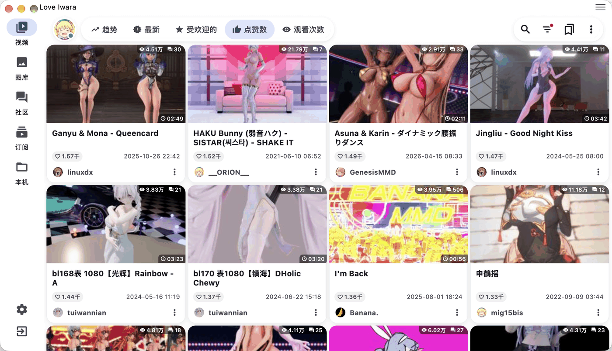|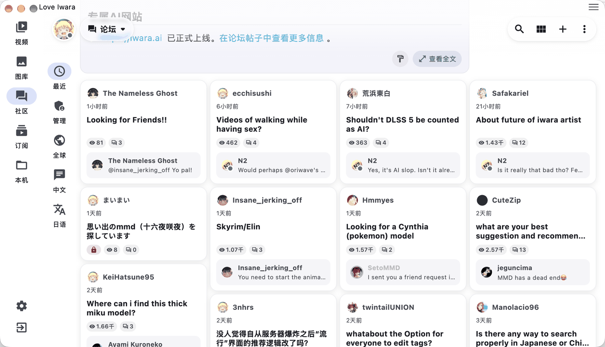|
|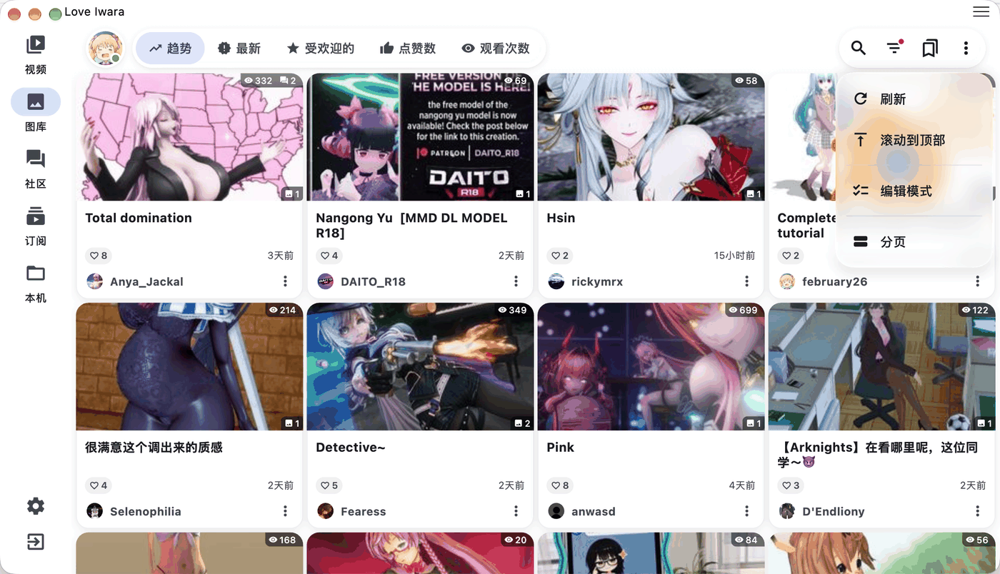|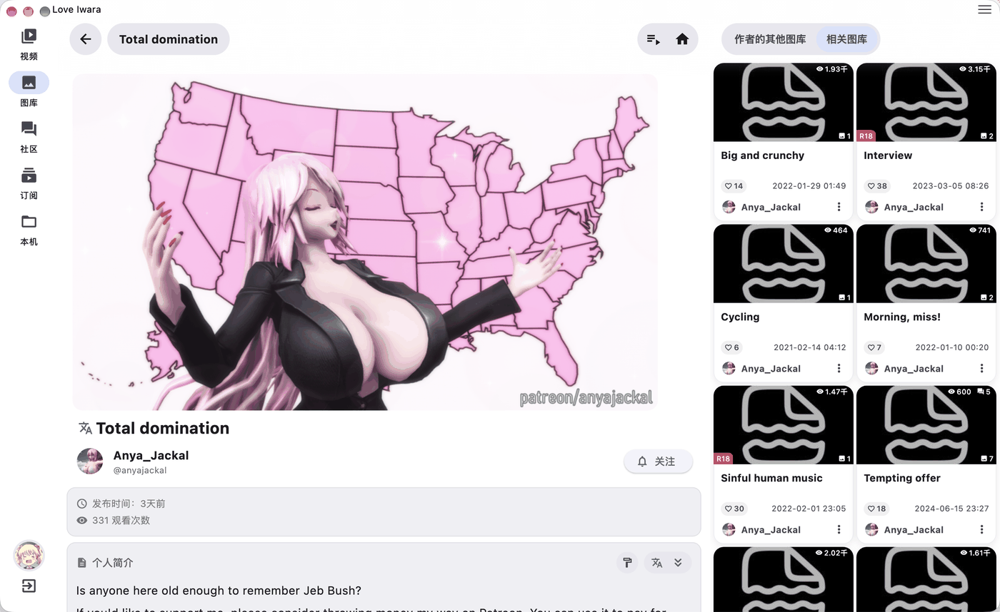|
|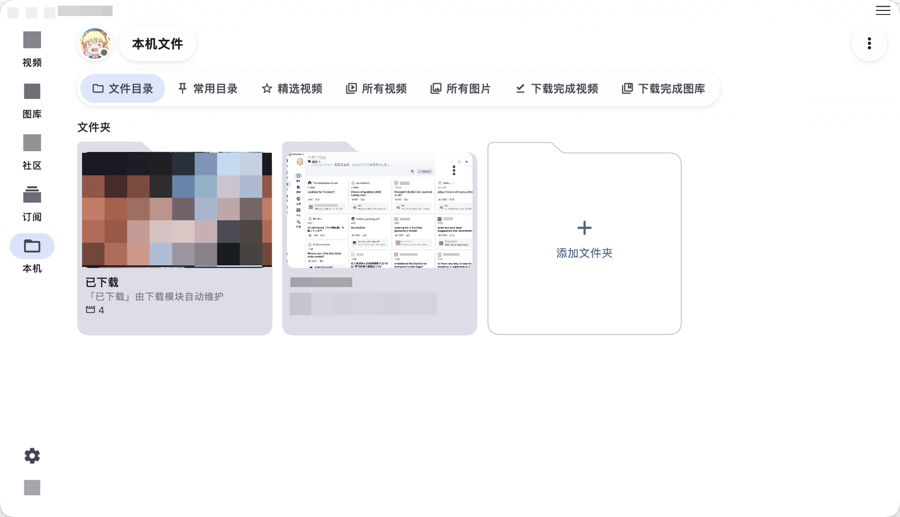|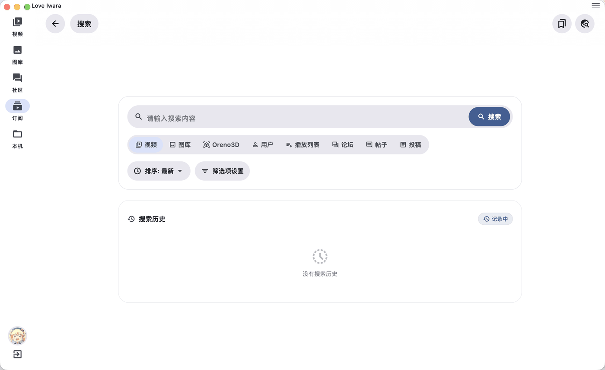|
|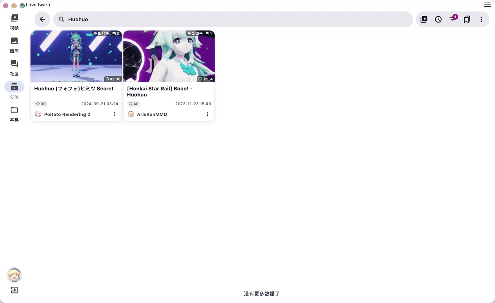|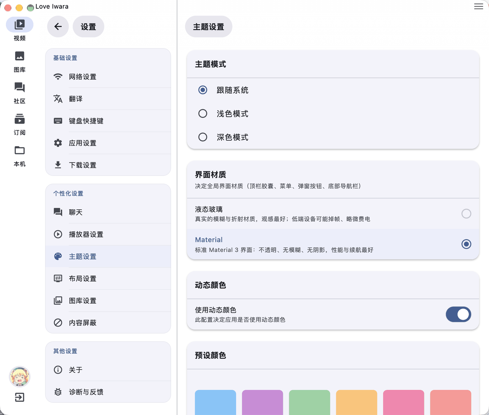|
|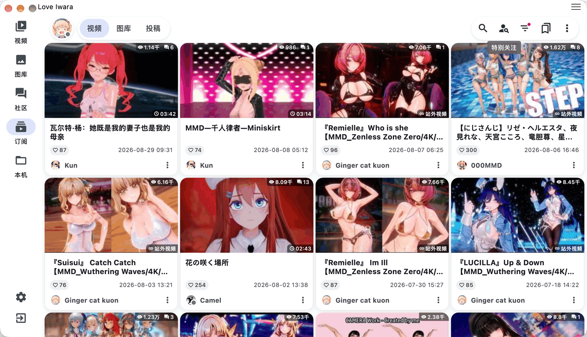|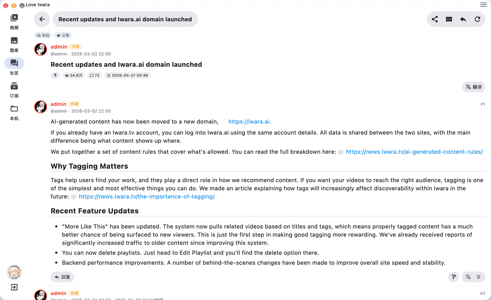|
|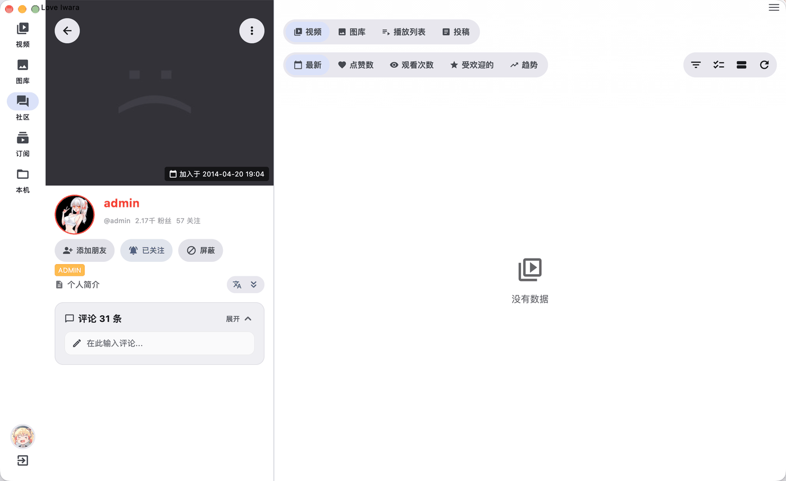|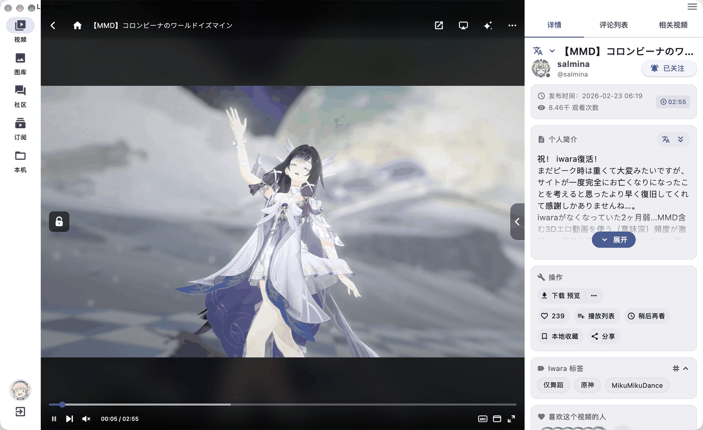|

## 🚀 빠르게 시작하기

```bash
# 1. 클론
git clone https://github.com/FoxSensei001/LoveIwara.git
cd LoveIwara

# 2. 툴체인 확인
flutter doctor

# 3. 의존성 설치
flutter pub get

# 4. 실행(연결된 기기를 자동 선택)
flutter run --flavor standard   # Android는 flavor가 필요합니다 — 아래 참고
# …또는 플랫폼을 지정(데스크톱/iOS는 flavor 불필요):
flutter run -d windows   # macos / linux / ios
```

> [!IMPORTANT]
> **Android는 두 개의 제품 플레이버로 배포됩니다.** `standard`는 일반 휴대폰/태블릿용 빌드(`minSdk 24`,
> 모든 ABI)이고, `quest`는 Meta Quest / Horizon OS용 빌드(`minSdk 34`, arm64 전용, 약 50MB의
> Meta Spatial SDK 포함)입니다. flavor가 존재하는 순간부터 AGP에는 더 이상 "flavor 없음" 변형이 없으므로,
> **모든 Android `flutter run` / `flutter build`는 반드시 `--flavor`를 지정해야 합니다** — 지정하지 않으면 그대로 실패합니다.

> [!TIP]
> `lib/i18n/*.i18n.yaml`을 수정한 뒤에는 `dart run slang`을 실행해 로컬라이제이션 문자열을 다시 생성하세요.
> 전체 의존성 목록은 [`pubspec.yaml`](../../pubspec.yaml)을 참고하세요 — 일부 패키지는 추가 설정이 필요합니다.

<details>
<summary><b>🛠️ 전체 개발 환경 설정</b></summary>

### 사전 준비물
- Flutter SDK(최신 stable 권장) · Dart SDK · Git
- 권장 IDE: Android Studio / VS Code / Cursor + Flutter 플러그인

### 플랫폼별 요구 사항

**Windows**
- Windows 10 이상(64비트), Visual Studio 2022 이상, Windows 10 SDK
```bash
flutter doctor -v
```

**macOS**
- 최신 macOS + Xcode + CocoaPods
```bash
sudo gem install cocoapods
```

**Linux**
```bash
# Ubuntu/Debian
sudo apt-get install clang cmake ninja-build pkg-config libgtk-3-dev liblzma-dev
# Fedora
sudo dnf install clang cmake ninja-build gtk3-devel
```

**Android** — Android Studio + Android SDK + 에뮬레이터/기기
**iOS** — Xcode + 시뮬레이터/기기 + Apple Developer 계정(배포용)

### 릴리스 바이너리 빌드
```bash
flutter build apk --release --flavor standard         # Android APK(휴대폰/태블릿)
flutter build appbundle --release --flavor standard   # Android AAB
flutter build apk --release --flavor quest --target-platform android-arm64   # Meta Quest APK
flutter build ios --release          # iOS
flutter build windows --release      # Windows
flutter build macos --release        # macOS
flutter build linux --release        # Linux
```

### 자주 쓰는 명령어
```bash
dart run slang     # i18n 문자열 재생성
flutter analyze    # 린트
flutter test       # 테스트 실행
flutter clean      # 빌드 캐시 정리
flutter devices    # 연결된 기기 목록
```

### 문제 해결
```bash
# 의존성 충돌
flutter pub cache repair && flutter clean && flutter pub get
# 에뮬레이터
flutter emulators && flutter emulators --launch <emulator_id>
```

</details>

<details>
<summary><b>🔐 Android 서명 설정</b></summary>

서명된 릴리스 APK를 빌드하려면:

**1. 키스토어 생성**(`android/app` 안에서 실행):
```bash
keytool -genkeypair -v -keystore keystore.jks -alias <your_key_alias> -keyalg RSA -keysize 2048 -validity 10000
```
`keystore.jks`가 `android/app`에 위치하는지 확인하세요.

**2. `android/app/build.gradle`에서 서명 설정**:
```groovy
signingConfigs {
    release {
        storeFile file("keystore.jks")
        storePassword System.getenv("KEYSTORE_PASSWORD") ?: project.findProperty("MY_KEYSTORE_PASSWORD")
        keyAlias System.getenv("KEY_ALIAS") ?: project.findProperty("MY_KEY_ALIAS")
        keyPassword System.getenv("KEY_PASSWORD") ?: project.findProperty("MY_KEY_PASSWORD")
    }
}
```
그리고 `android/gradle.properties`에 플레이스홀더를 추가합니다:
```properties
MY_KEYSTORE_PASSWORD=${KEYSTORE_PASSWORD}
MY_KEY_ALIAS=${KEY_ALIAS}
MY_KEY_PASSWORD=${KEY_PASSWORD}
```

**3. GitHub Actions** — 저장소 Secrets에 추가: `KEYSTORE_BASE64`(`keystore.jks`의 base64), `KEYSTORE_PASSWORD`, `KEY_ALIAS`, `KEY_PASSWORD`. 이후 `.github/workflows/build.yml`에서:
```yaml
env:
  KEYSTORE_PASSWORD: ${{ secrets.KEYSTORE_PASSWORD }}
  KEY_ALIAS: ${{ secrets.KEY_ALIAS }}
  KEY_PASSWORD: ${{ secrets.KEY_PASSWORD }}

steps:
  - name: Setup Keystore
    run: |
      echo "${{ secrets.KEYSTORE_BASE64 }}" | base64 --decode > android/app/keystore.jks
    shell: bash
```

**4. 빌드** — `flutter build apk --release --flavor standard` → 결과물은 `build/app/outputs/flutter-apk/app-standard-release.apk`에 생성됩니다. Quest 빌드는 `flutter build apk --release --flavor quest --target-platform android-arm64` → `app-arm64-v8a-quest-release.apk`.

</details>

## 🌍 국제화

이제 UI는 **12개 언어**로 제공됩니다. 최초의 네 언어(English / 简体中文 / 繁體中文 / 日本語)를 제외한 나머지 번역은 대부분 기계 번역입니다. 번역 개선에 협력하고 싶다면 간체 중국어 템플릿인 [`lib/i18n/zh-CN.i18n.yaml`](../../lib/i18n/zh-CN.i18n.yaml)을 기준으로 작업한 뒤 `dart run slang`을 실행하세요. 언어별 전체 현황과 유지 관리 명령어는 **[`docs/i18n/README.md`](../i18n/README.md)**(중국어)를 참고하세요.

### 🏷️ Iwara 태그 로컬라이제이션

Iwara의 원본 태그는 영어식 키입니다(예: `mother`, `blue_archive`). 앱에는 커뮤니티가 관리하는 사전이 내장되어 있어 각 태그를 **간체 중국어 / 번체 중국어 / 일본어 / 영어**로 매핑하므로, 상세 페이지·검색·태그 목록 페이지 전반에서 현재 언어에 맞춰 태그가 표시됩니다.

작동 방식:

- **사전**: [`tool/data/iwara_tags/`](../../tool/data/iwara_tags/)에 위치합니다. 앱은 병합·압축된 [`iwara_tags.min.json`](../../tool/data/iwara_tags/iwara_tags.min.json)을 사용합니다.
- **배포**: 오프라인 대체용으로 앱에 내장(`assets/data/iwara_tags.min.json`)되며, jsDelivr CDN을 통해 핫 업데이트됩니다 — 따라서 **새 앱 빌드를 배포하지 않고도** 번역을 개선할 수 있습니다.
- **앱 내부**: 태그 칩에는 번역된 이름이 표시됩니다. 상세 페이지의 태그 카드에서는 펼침/접힘 행에 아이콘 버튼이 있어 **원본 키 ⇄ 번역** 전환이 가능하며, 태그를 길게 누르거나 우클릭(또는 태그 목록 페이지에서 태그 제목 탭)하면 번역과 원본 키, 복사 버튼, 피드백 링크를 함께 보여주는 대화상자가 열립니다.

이는 2,600개 이상의 ACG / Vtuber / NSFW 용어에 대한 최선의 노력을 다한 번역이며, 오류가 있을 수 있습니다.

> **잘못되었거나 어색한 번역을 발견하셨나요?** 전용 이슈에 신고해 주세요: **https://github.com/FoxSensei001/LoveIwara/issues/98**(앱 내 태그 대화상자에도 이 링크가 연결되어 있습니다).

**수정 기여하기**(관리자/기여자용):

1. 사람이 읽을 수 있는 [`iwara_tags_localized.json`](../../tool/data/iwara_tags/iwara_tags_localized.json)을 수정합니다(태그별 `zh-CN` / `zh-TW` / `ja` / `en`).
2. 병합된 산출물과 내장 에셋을 재생성합니다: `dart run tool/data/iwara_tags/build_localized_min.dart`.
3. 소스 파일과 생성된 `iwara_tags.min.json`을 함께 커밋합니다([`tool/data/iwara_tags/README.md`](../../tool/data/iwara_tags/README.md) 참고).

서드파티 **Oreno3d** 메타데이터(원작 / 캐릭터 / 태그)도 동일한 방식으로 로컬라이즈됩니다 — 사전은 [`tool/data/oreno3d_tags/`](../../tool/data/oreno3d_tags/)에 있으며, 내장 에셋 + jsDelivr CDN으로 배포되고, 동영상 상세 페이지와 검색 카드에서 현재 언어로 표시됩니다.

> [!NOTE]
> 위의 두 태그 사전은 **zh-CN / zh-TW / ja / en 네 언어만** 유지 관리하며, 나머지 8개 UI 언어(ko / th / id / vi / es / ru / fr / de)로는 확장되어 있지 *않습니다*. 이들은 문자 그대로의 번역보다는 서브컬처 특유의 표현에 크게 의존하는 2,600개 이상의 ACG / Vtuber / 동인 은어 용어이며, 결과를 검토할 사람이 없는 채로 AI 번역을 12개 언어까지 확대하면 아무도 발견하지 못하는 잘못된 태그가 남을 위험이 있습니다. 이 네 언어 이외의 UI 언어에서는 태그가 해당 언어로 번역되지 않고, 대신 사전에 있는 **영어** 이름으로 대체되어 표시됩니다(예: `mother` → `Mother`). 사전에 아예 등록되지 않은 태그만 원본 키로 대체되며, 이는 UI 언어와 무관하게 발생합니다. 자세한 내용과 이유는 [`docs/i18n/README.md`](../i18n/README.md)를 참고하세요.

## 🙏 감사의 말

이 프로젝트는 다음의 훌륭한 저장소들로부터 많은 영감과 모범 사례를 배웠습니다:

<div align="center">

<table>
  <tr>
    <td align="center" width="50%">
      <a href="https://github.com/iwrqk/iwrqk">
        
      </a>
      <br />
      <sub><b>iwrqk/iwrqk</b></sub>
      <br />
      <sub>훌륭한 Flutter 기반 Iwara 클라이언트</sub>
    </td>
    <td align="center" width="50%">
      <a href="https://github.com/wgh136/PicaComic">
        
      </a>
      <br />
      <sub><b>wgh136/PicaComic</b></sub>
      <br />
      <sub>잘 구조화된 Flutter 만화 애플리케이션</sub>
    </td>
  </tr>
</table>

</div>

### 기여자

기여해 주신 모든 분들께 감사드립니다! 🎉

<div align="center">

<a href="https://github.com/FoxSensei001/LoveIwara/graphs/contributors">
  
</a>

</div>

<sub>[contrib.rocks](https://contrib.rocks)로 제작되었습니다</sub>

## 🤝 기여하기

Pull Request를 환영합니다! 큰 변경 사항은 먼저 이슈를 열어 어떤 것을 바꾸고 싶은지 논의해 주세요. 새 이슈를 등록하기 전에 기존 [이슈](https://github.com/FoxSensei001/LoveIwara/issues)를 확인해 주세요. 질문이 있으신가요? [텔레그램 그룹](https://t.me/+ITH4CV6Z_sc2ZWVl)에 참여해 주세요.

## 💬 커뮤니티

텔레그램에서 만나요: **[여기를 클릭해 그룹에 참여하세요](https://t.me/+ITH4CV6Z_sc2ZWVl)**.

---

<div align="center">
<sub>❤️와 Flutter로 만들었습니다 · 이것은 팬이 만든 클라이언트입니다 — Iwara 공식을 응원해 주세요.</sub>
</div>
